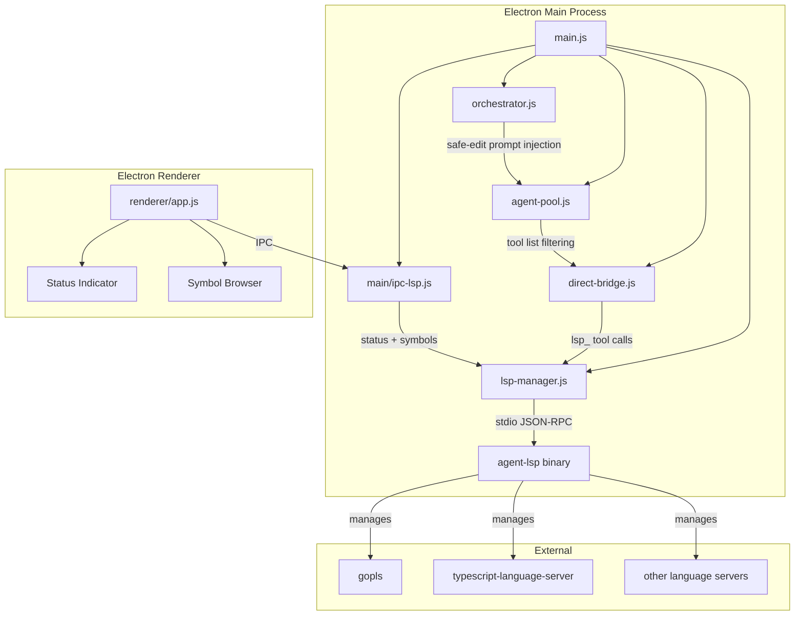

# Design Document: Agent LSP Integration

## Overview

This design integrates agent-lsp — a Go binary exposing 53 LSP-backed tools via stdio JSON-RPC — into the QwenCoder Mac Studio Electron application. The integration touches six existing modules and introduces two new ones:

- **New**: `lsp-manager.js` — spawns, health-checks, restarts, and shuts down the agent-lsp process
- **New**: `main/ipc-lsp.js` — IPC handlers for renderer ↔ main process LSP communication
- **Modified**: `direct-bridge.js` — routes `lsp_` tool calls, injects speculative edit previews and post-edit diagnostics
- **Modified**: `agent-pool.js` — adds role-specific LSP tool sets per subagent type
- **Modified**: `orchestrator.js` — injects safe-edit workflow instructions for implementation agents
- **Modified**: `main.js` — wires LSP manager lifecycle to app events and project switching
- **Modified**: `preload.js` — exposes LSP IPC channels to the renderer
- **Modified**: `renderer/app.js` — status indicator, symbol browser UI

The design follows the existing codebase conventions: CommonJS modules, `'use strict'`, EventEmitter patterns, and no external dependencies beyond what's already in `package.json`.

## Architecture



### Data Flow

1. **Startup**: `main.js` calls `lspManager.start(projectDir)` after `setCurrentProject`. The manager spawns `agent-lsp` via `child_process.spawn` with stdio transport, detects language servers on PATH, and transitions status from `stopped` → `starting` → `ready`.

2. **Tool routing**: When DirectBridge's `executeTool` receives an `lsp_`-prefixed tool name, it forwards the call to `lspManager.call(toolName, args)` which sends a JSON-RPC request over stdin and reads the response from stdout.

3. **Speculative edits**: Before `write_file` execution, DirectBridge calls `lsp_simulate_edit_atomic`. If new errors appear, the diagnostic diff is included in the tool result for the agent to review.

4. **Post-edit diagnostics**: After `write_file`/`edit_file` completes, DirectBridge calls `lsp_get_diagnostics` and appends any errors to the tool result.

5. **UI updates**: The renderer polls `lspStatus` on load and subscribes to `onLspStatusChange` for real-time status transitions. Symbol data is fetched on-demand via `lspSymbols(filePath)`.

## Components and Interfaces

### lsp-manager.js

```javascript
// New module — manages the agent-lsp process lifecycle
'use strict'
const { EventEmitter } = require('node:events')

class LspManager extends EventEmitter {
  // Status: 'stopped' | 'starting' | 'ready' | 'error' | 'degraded'
  
  constructor(options = {}) // options: { binaryPath, healthCheckInterval, maxRestarts }
  
  // Lifecycle
  async start(projectDir)    // Spawn agent-lsp, detect language servers, begin health checks
  async stop()               // Graceful shutdown with 5s timeout, then SIGKILL
  async restart(projectDir)  // stop() then start() — used on project switch
  
  // Tool execution
  async call(toolName, args) // Send JSON-RPC request, return result (30s timeout)
  
  // Status
  getStatus()                // Returns { status, servers: [{ name, languages }] }
  
  // Events emitted:
  // 'status-change' → { oldStatus, newStatus }
  // 'error' → { message }
}
```

**Key behaviors**:
- Binary discovery: checks `resources/bin/agent-lsp`, then `PATH`
- Health check: periodic JSON-RPC ping every 30s
- Restart policy: up to 3 restarts with exponential backoff (2s, 4s, 8s)
- Language server detection: scans PATH for known binaries (`gopls`, `typescript-language-server`, `pyright`, `rust-analyzer`, etc.)

### direct-bridge.js modifications

```javascript
// In executeTool — new lsp_ routing branch
async function executeTool(name, args, cwd, browserInstance, lspManager) {
  // Existing web_* routing...
  // Existing browser_* routing...
  
  // NEW: Route lsp_ tools to agent-lsp
  if (name.startsWith('lsp_') && lspManager) {
    if (lspManager.getStatus().status !== 'ready') {
      return { error: 'LSP not available. Use built-in tools instead.' }
    }
    try {
      const result = await Promise.race([
        lspManager.call(name, args),
        new Promise((_, reject) => setTimeout(() => reject(new Error('LSP tool timed out (30s)')), 30000))
      ])
      return { result: JSON.stringify(result) }
    } catch (err) {
      return { error: `LSP tool error: ${err.message}. Try using built-in alternatives.` }
    }
  }
  // ... existing switch(name) ...
}
```

**Speculative edit hook** (in `_agentLoop`, after tool call parsing, before execution):
```javascript
// Before write_file execution, if LSP is ready
if (fnName === 'write_file' && lspManager?.getStatus().status === 'ready') {
  try {
    const simResult = await lspManager.call('lsp_simulate_edit_atomic', { path: fnArgs.path, content: fnArgs.content })
    if (simResult?.newDiagnostics?.length > 0) {
      // Include diagnostic preview in result, let agent decide
    }
  } catch { /* proceed with write on failure */ }
}
```

**Post-edit diagnostic hook** (after write_file/edit_file execution):
```javascript
// After successful write_file or edit_file
if ((fnName === 'write_file' || fnName === 'edit_file') && lspManager?.getStatus().status === 'ready') {
  try {
    const diags = await Promise.race([
      lspManager.call('lsp_get_diagnostics', { path: fnArgs.path }),
      new Promise((_, reject) => setTimeout(() => reject(new Error('timeout')), 10000))
    ])
    if (diags?.errors?.length > 0) {
      content = `⚠️ Edit introduced errors:\n${formatDiagnostics(diags.errors)}\n\n${content}`
    }
  } catch { /* skip diagnostics on failure */ }
}
```

**Tool list filtering** (in `_streamCompletion`):
```javascript
// Build tool list based on LSP status
function getToolDefs(lspManager, agentRole) {
  const tools = [...TOOL_DEFS] // built-in tools
  if (lspManager?.getStatus().status === 'ready') {
    const lspTools = LSP_TOOL_SETS[agentRole] || []
    tools.push(...lspTools)
  }
  return tools
}
```

### agent-pool.js modifications

```javascript
// Role-specific LSP tool sets
const LSP_TOOL_SETS = {
  'explore': ['lsp_get_document_symbols', 'lsp_get_hover', 'lsp_get_definition', 'lsp_get_references', 'lsp_get_call_hierarchy'],
  'context-gather': ['lsp_get_document_symbols', 'lsp_get_definition', 'lsp_get_references', 'lsp_get_type_definition'],
  'code-search': ['lsp_get_document_symbols', 'lsp_get_references', 'lsp_workspace_symbol', 'lsp_get_call_hierarchy'],
  'implementation': ['lsp_simulate_edit_atomic', 'lsp_get_diagnostics', 'lsp_get_definition', 'lsp_get_references', 'lsp_get_change_impact', 'lsp_apply_code_action'],
  'general': ['lsp_simulate_edit_atomic', 'lsp_get_diagnostics', 'lsp_get_definition', 'lsp_get_references', 'lsp_get_change_impact', 'lsp_apply_code_action'],
}

// In registerType or selectType — merge LSP tools when status is ready
function getLspToolsForRole(roleName, lspStatus) {
  if (lspStatus !== 'ready') return []
  return LSP_TOOL_SETS[roleName] || []
}
```

### orchestrator.js modifications

```javascript
// Safe-edit workflow instructions injected into implementation agent prompts
const SAFE_EDIT_INSTRUCTIONS = `
## LSP Safe-Edit Workflow
Before modifying exported symbols:
1. Check blast radius: call lsp_get_change_impact to see affected files
2. Preview changes: call lsp_simulate_edit_atomic before writing
3. Verify after writing: call lsp_get_diagnostics to check for errors
Follow this workflow for every file modification.`

// In _dispatchNode, when dispatching to implementation agents with LSP ready:
if (agentType?.name === 'implementation' && lspManager?.getStatus().status === 'ready') {
  task.systemPromptSuffix = SAFE_EDIT_INSTRUCTIONS
}
```

### main/ipc-lsp.js

```javascript
// New IPC handler module for LSP operations
function register(ipcMain, { getLspManager }) {
  ipcMain.handle('lsp-status', async () => {
    return getLspManager()?.getStatus() || { status: 'stopped', servers: [] }
  })
  
  ipcMain.handle('lsp-symbols', async (_, filePath) => {
    const mgr = getLspManager()
    if (!mgr || mgr.getStatus().status !== 'ready') return { symbols: [] }
    try {
      return await mgr.call('lsp_get_document_symbols', { path: filePath })
    } catch { return { symbols: [] } }
  })
}
```

### preload.js additions

```javascript
// LSP status and symbols
lspStatus:         ()        => ipcRenderer.invoke('lsp-status'),
lspSymbols:        (p)       => ipcRenderer.invoke('lsp-symbols', p),
onLspStatusChange: (cb)      => ipcRenderer.on('lsp-status-change', (_, d) => cb(d)),
offLspStatusChange:()        => ipcRenderer.removeAllListeners('lsp-status-change'),
```

### buildProjectContext enhancement

```javascript
// In buildProjectContext — add symbol outlines when LSP is ready
async function buildProjectContext(cwd, taskGraphPath, lspManager) {
  const parts = []
  // 1. File tree (existing)
  // 2. Task graph (existing)
  // 3. NEW: Symbol outlines for top 10 entry-point files
  if (lspManager?.getStatus().status === 'ready') {
    const entryFiles = detectEntryPoints(cwd) // package.json main, index.*, etc.
    const symbolParts = []
    for (const file of entryFiles.slice(0, 10)) {
      try {
        const symbols = await lspManager.call('lsp_get_document_symbols', { path: file })
        if (symbols?.length > 0) {
          symbolParts.push(`### ${path.relative(cwd, file)}\n${formatSymbolOutline(symbols)}`)
        }
      } catch { /* skip file */ }
    }
    if (symbolParts.length > 0) {
      parts.push(`## Symbol Outlines\n${symbolParts.join('\n')}`)
    }
  }
  // Cap total to 4000 chars
  let combined = parts.join('\n\n')
  if (combined.length > 4000) combined = combined.slice(0, 4000) + '\n... [truncated]'
  return combined
}
```

## Data Models

### LSP Status

```javascript
// Status enum values
const LSP_STATUSES = ['stopped', 'starting', 'ready', 'error', 'degraded']

// Status object returned by getStatus()
{
  status: 'ready',           // one of LSP_STATUSES
  servers: [                 // active language servers
    { name: 'gopls', languages: ['go'] },
    { name: 'typescript-language-server', languages: ['javascript', 'typescript'] },
  ],
  projectDir: '/path/to/project',
  uptime: 12345,             // ms since last start
}
```

### LSP Tool Definition

```javascript
// Tool definition shape (same as existing TOOL_DEFS entries)
{
  type: 'function',
  function: {
    name: 'lsp_get_document_symbols',
    description: 'Get document symbols (functions, classes, variables) for a file.',
    parameters: {
      type: 'object',
      properties: {
        path: { type: 'string', description: 'File path to get symbols for' },
      },
      required: ['path'],
    },
  },
}
```

### JSON-RPC Message Format (stdio)

```javascript
// Request sent to agent-lsp stdin
{ jsonrpc: '2.0', id: 1, method: 'tools/call', params: { name: 'lsp_get_document_symbols', arguments: { path: 'src/main.js' } } }

// Response read from agent-lsp stdout
{ jsonrpc: '2.0', id: 1, result: { content: [{ type: 'text', text: '...' }] } }
```

### Speculative Edit Result

```javascript
{
  originalDiagnostics: [{ file, line, severity, message }],
  newDiagnostics: [{ file, line, severity, message }],
  added: [{ file, line, severity, message }],    // new errors introduced
  removed: [{ file, line, severity, message }],  // errors fixed
}
```

### Role-to-Tool Mapping

```javascript
const LSP_TOOL_SETS = {
  'explore':        ['lsp_get_document_symbols', 'lsp_get_hover', 'lsp_get_definition', 'lsp_get_references', 'lsp_get_call_hierarchy'],
  'context-gather': ['lsp_get_document_symbols', 'lsp_get_definition', 'lsp_get_references', 'lsp_get_type_definition'],
  'code-search':    ['lsp_get_document_symbols', 'lsp_get_references', 'lsp_workspace_symbol', 'lsp_get_call_hierarchy'],
  'implementation': ['lsp_simulate_edit_atomic', 'lsp_get_diagnostics', 'lsp_get_definition', 'lsp_get_references', 'lsp_get_change_impact', 'lsp_apply_code_action'],
  'general':        ['lsp_simulate_edit_atomic', 'lsp_get_diagnostics', 'lsp_get_definition', 'lsp_get_references', 'lsp_get_change_impact', 'lsp_apply_code_action'],
}
```

