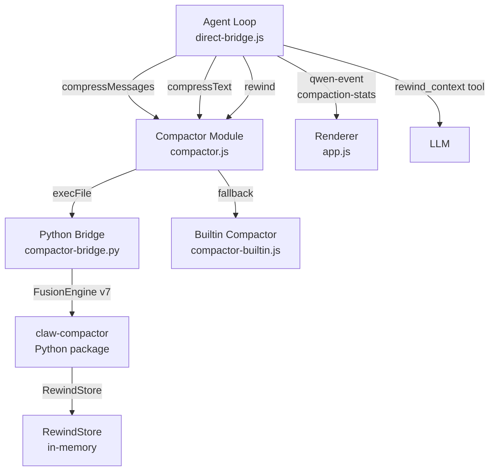

# Design Document: Compactor v7 Upgrade

## Overview

This design upgrades the claw-compactor integration from basic `FusionEngine.compress()` / `compress_messages()` usage to the full v7 pipeline. The upgrade touches four layers:

1. **Python bridge** (`compactor-bridge.py`) — new commands for content-type hints, RewindStore, per-message stats, rewind retrieval, and SimHash dedup
2. **Node.js module** (`compactor.js`) — exposes v7 features to callers, adds `rewind()`, forwards content-type and dedup options
3. **Agent loop** (`direct-bridge.js`) — replaces `trimMessages()` with compactor-based compression, adds intelligent tool result compression with content-type detection, registers `rewind_context` tool
4. **Builtin fallback** (`compactor-builtin.js`) — smarter type-aware compression for code, JSON, log, and search content
5. **UI** (`renderer/app.js`) — compression stats badge in the agent stats bar

The goal is to reduce prompt sizes more effectively, preserve more meaningful context, prevent OOM-induced HTTP 500 errors during local MLX inference, and allow the LLM to retrieve original content on demand via rewind.

## Architecture



**Data flow for message compression:**
1. Agent loop detects token count exceeds `MAX_INPUT_TOKENS`
2. Calls `compactor.compressMessages()` with `{ dedup: true }` and per-message `contentType` hints
3. Compactor module invokes Python bridge via `execFile`
4. Python bridge calls `FusionEngine(rewind=True).compress_messages()` with hints
5. Returns compressed messages + per-message stats + rewind keys
6. If Python bridge fails/times out, falls back to builtin compactor
7. Agent loop emits `compaction-stats` event to renderer

**Data flow for tool result compression:**
1. Tool executes and returns content
2. Agent loop detects content exceeds threshold (8KB / 24KB for read_file)
3. Determines `Content_Type_Hint` from tool name + content sniffing
4. Calls `compactor.compressText()` with hint
5. Appends compression notice with rewind key to result
6. If compactor fails, falls back to existing hard truncation

## Components and Interfaces

### Python Bridge (`compactor-bridge.py`)

**New commands added to the CLI dispatch:**

| Command | Input (stdin JSON) | Output (stdout JSON) |
|---|---|---|
| `compress-messages` | `{ messages: [{role, content, contentType?}], options: {dedup?, keepRecent?} }` | `{ messages, stats: { compressed, per_message: [{original_tokens, compressed_tokens, reduction_pct, stages_applied}], dedup_removed? } }` |
| `compress-text` | `{ text, content_type, rewind? }` | `{ compressed, rewind_key?, stats: {original_tokens, compressed_tokens, reduction_pct, stages_applied} }` |
| `rewind` | `{ key }` | `{ content, found: true }` or `{ found: false, error }` |
| `status` | (none) | `{ installed, version, rewind_enabled }` |

**FusionEngine initialization:** `FusionEngine(rewind=True)` — singleton per process invocation. The engine instance is created once in `get_engine()` and cached.

### Node.js Compactor Module (`compactor.js`)

**Updated exports:**

```js
module.exports = {
  compressMessages(pythonPath, messages, options = {}),  // updated: forwards contentType, dedup
  compressText(pythonPath, text, contentType = 'auto', options = {}),  // updated: returns rewind_key
  rewind(pythonPath, key),  // NEW
  getStatus(pythonPath),  // updated: includes rewind_enabled
  checkInstalled(pythonPath),
}
```

**Fallback behavior:** When Python bridge fails or times out, all functions fall back to `compactor-builtin.js` equivalents. The returned stats include `engine: 'builtin'` or `engine: 'python'` to indicate which path was used.

### Agent Loop Integration (`direct-bridge.js`)

**Changes to `_agentLoop()`:**

1. Replace the `trimMessages()` call block with a compactor call:
   - Call `compressMessages(pythonPath, messages, { dedup: true, keepRecent: 4 })`
   - If compactor result still exceeds `MAX_INPUT_TOKENS`, fall back to `trimMessages()`
   - Emit `compaction-stats` event with stats

2. Replace the hard truncation block for tool results:
   - Detect content type via `detectContentType(toolName, content)`
   - Call `compressText(pythonPath, content, contentType)` for oversized results
   - Append compression notice: `\n\n[compressed: {reduction}% reduction, rewind key: {key}]`
   - Fall back to existing `slice()` truncation on failure

3. Register `rewind_context` tool in `TOOL_DEFS`:
   - Single `key` parameter
   - Handler calls `compactor.rewind(pythonPath, key)`

**New helper function — `detectContentType(toolName, content)`:**

```js
function detectContentType(toolName, content) {
  // JSON override: content starts with { or [ and parses
  if (content && (content.trimStart().startsWith('{') || content.trimStart().startsWith('['))) {
    try { JSON.parse(content); return 'json' } catch {}
  }
  // Diff override: contains diff markers
  if (content && /^[-+]{3}\s/m.test(content) && /^@@\s/m.test(content)) return 'diff'
  // Tool name mapping
  const map = {
    read_file: 'code', search_files: 'search', grep_search: 'search',
    execute_command: 'log', bash: 'log', list_dir: 'log',
    browser_screenshot: 'prose', browser_navigate: 'prose',
    browser_click: 'prose', browser_type: 'prose',
  }
  return map[toolName] || 'auto'
}
```

### Builtin Compactor (`compactor-builtin.js`)

**Updated `compressText()` to accept and use `contentType`:**

| Content Type | Strategy |
|---|---|
| `code` | Remove single-line comments (`//`, `#`, `*`), collapse consecutive blank lines, remove trailing whitespace, then head/tail truncation |
| `json` | Detect repeated array elements → replace with summary `{ count, schema, first }`, then truncation |
| `log` | Fold repeated consecutive lines → `[×N]` suffix, then truncation |
| `search` | Deduplicate results sharing same file path + overlapping line ranges, then truncation |
| `auto` / other | Existing head/tail truncation behavior |

Stats format matches Python compactor: `{ compressed, original_tokens, compressed_tokens, reduction_pct }`.

### Renderer Stats Badge (`renderer/app.js`)

**New event handler for `compaction-stats`:**

Adds a stat chip to the existing `updateAgentStatsBar()` function. The chip shows:
- Compact view: `🗜 42% ↓` with engine indicator color (green = python, amber = builtin)
- Hover tooltip: original tokens, compressed tokens, reduction %, engine type, stages applied

Implementation: store latest compaction stats in a module-level variable, render as an additional `stat-chip` in `updateAgentStatsBar()`.

## Data Models

### Compression Stats Object

```js
{
  compressed: true,
  engine: 'python' | 'builtin',
  original_tokens: 12500,
  compressed_tokens: 4200,
  reduction_pct: 66.4,
  stages_applied: ['simhash_dedup', 'ast_compress', 'token_trim'],  // python only
  per_message: [  // message compression only
    { original_tokens: 800, compressed_tokens: 200, reduction_pct: 75.0, stages_applied: [...] }
  ],
  dedup_removed: 3,  // number of near-duplicate segments collapsed
  rewind_keys: ['rk_abc123', 'rk_def456'],  // keys for retrieving originals
}
```

### Content Type Hint Enum

Valid values: `code`, `json`, `log`, `diff`, `search`, `prose`, `auto`

### Rewind Key Format

Opaque string returned by FusionEngine's RewindStore. Format is implementation-defined by claw-compactor (typically `rk_{hash}`). The Node.js layer treats it as an opaque string.

### Tool Definition — rewind_context

```js
{
  type: 'function',
  function: {
    name: 'rewind_context',
    description: 'Retrieve the original uncompressed content for a previously compressed section. Use when you need full detail from a compressed tool result.',
    parameters: {
      type: 'object',
      properties: {
        key: { type: 'string', description: 'The rewind key from the compression notice' },
      },
      required: ['key'],
    },
  },
}
```


## Correctness Properties

*A property is a characteristic or behavior that should hold true across all valid executions of a system — essentially, a formal statement about what the system should do. Properties serve as the bridge between human-readable specifications and machine-verifiable correctness guarantees.*

### Property 1: Error fallback preserves original content

*For any* array of messages, if the Python FusionEngine raises an exception during compression, the returned messages array SHALL be identical to the input messages array.

**Validates: Requirements 1.7**

### Property 2: Content-type hint forwarding for messages

*For any* array of messages where each message includes a `contentType` field, the JSON payload sent to the Python bridge SHALL contain those same `contentType` values in the corresponding message positions.

**Validates: Requirements 2.1**

### Property 3: Content-type hint forwarding for text

*For any* `contentType` string passed to `compressText()`, the JSON payload sent to the Python bridge SHALL contain that `contentType` as the `content_type` field.

**Validates: Requirements 2.2**

### Property 4: Compression stats passthrough

*For any* stats object returned by the Python bridge (containing `original_tokens`, `compressed_tokens`, `reduction_pct`, and `stages_applied`), the compactor module SHALL return the same stats object without modification.

**Validates: Requirements 2.4**

### Property 5: Fallback to builtin on Python failure

*For any* input (messages or text), when the Python bridge process fails (error, timeout, or invalid JSON output), the compactor SHALL return a valid result from the builtin compactor with `engine: 'builtin'` in the stats.

**Validates: Requirements 2.5**

### Property 6: System message and recent messages preserved after compression

*For any* message array containing a system message and at least 5 messages, after compressor-based compression in the agent loop, the system message and the last 4 messages SHALL be identical to the originals.

**Validates: Requirements 3.2**

### Property 7: Content-type detection from tool name and content

*For any* tool name and content string, `detectContentType` SHALL return:
- `'json'` when content is valid JSON (regardless of tool name)
- `'diff'` when content contains diff markers `---`, `+++`, `@@` (regardless of tool name)
- The mapped type for known tool names (`read_file` → `code`, `search_files`/`grep_search` → `search`, `bash`/`execute_command`/`list_dir` → `log`, browser tools → `prose`)
- `'auto'` when no mapping matches and content has no special markers

**Validates: Requirements 4.2, 5.1, 5.2, 5.3, 5.4**

### Property 8: Compression notice includes stats and rewind key

*For any* compressed tool result where the compactor returns a `rewind_key` and `reduction_pct`, the content appended to the tool result SHALL contain both the reduction percentage and the rewind key string.

**Validates: Requirements 4.4, 6.1**

### Property 9: Builtin code compression removes comments and collapses blanks

*For any* code string containing single-line comments (`//` or `#` prefixed lines) and consecutive blank lines, after builtin compression with `contentType: 'code'`, the output SHALL contain no single-line comment lines and no runs of more than one consecutive blank line.

**Validates: Requirements 7.1**

### Property 10: Builtin JSON compression summarizes repeated arrays

*For any* JSON string containing an array with N identical or near-identical elements (N > 3), after builtin compression with `contentType: 'json'`, the output SHALL contain a summary indicating the element count and schema rather than all N elements.

**Validates: Requirements 7.2**

### Property 11: Builtin log compression folds repeated lines

*For any* log string containing N consecutive identical lines (N ≥ 2), after builtin compression with `contentType: 'log'`, the output SHALL contain exactly one instance of that line with a repetition count indicator.

**Validates: Requirements 7.3**

### Property 12: Builtin search deduplication reduces overlapping results

*For any* search result string containing multiple results for the same file path with overlapping line ranges, after builtin compression with `contentType: 'search'`, the output SHALL contain fewer result entries than the input.

**Validates: Requirements 7.4**

### Property 13: Builtin stats format consistency

*For any* input text and contentType, the builtin compactor SHALL return a stats object containing `original_tokens` (number), `compressed_tokens` (number), and `reduction_pct` (number) fields.

**Validates: Requirements 7.6**

## Error Handling

| Scenario | Handling |
|---|---|
| Python bridge process fails (exit code ≠ 0) | Compactor module falls back to builtin compactor, returns `engine: 'builtin'` |
| Python bridge times out (30s for messages, 15s for text) | Same fallback as above |
| Python bridge returns invalid JSON | Same fallback as above |
| FusionEngine raises during compression | Python bridge catches, returns original content + error in stats |
| Rewind key not found / expired | `rewind()` returns `{ found: false, error: 'Content no longer available' }` |
| Compactor fails to reduce below MAX_INPUT_TOKENS | Agent loop applies `trimMessages()` as secondary fallback |
| `compressText()` fails for a tool result | Agent loop falls back to existing `content.slice(0, limit)` truncation |
| `claw-compactor` package not installed | `get_engine()` returns null, bridge returns original content with `installed: false` |

## Testing Strategy

### Property-Based Tests (`test/compactor.property.test.js`)

Using `fast-check` v4 with `{ numRuns: 150 }` per property. Properties 1–13 from the Correctness Properties section above.

Key generators needed:
- **Message arrays**: `fc.array(fc.record({ role: fc.constantFrom('user', 'assistant', 'system', 'tool'), content: fc.string(), contentType: fc.constantFrom('code', 'json', 'log', 'search', 'prose', 'auto', undefined) }))` 
- **Tool names**: `fc.constantFrom('read_file', 'search_files', 'grep_search', 'bash', 'execute_command', 'list_dir', 'browser_screenshot', 'browser_navigate', 'unknown_tool')`
- **Content strings**: `fc.string()`, `fc.constantFrom(...)` for specific content types
- **JSON content**: `fc.json()` for valid JSON, `fc.string()` for invalid
- **Code content**: custom generator producing strings with `//` comments and blank lines
- **Log content**: custom generator producing repeated lines

Tests will mock the Python bridge (`execFile`) to isolate Node.js logic. Python bridge tests are integration tests.

### Unit Tests (`test/compactor.test.js`)

- `detectContentType()` — specific examples for each tool name and content override
- `rewind_context` tool registration — verify it's in TOOL_DEFS
- Agent loop compression path — mock compactor, verify it's called instead of trimMessages
- Agent loop fallback — mock compactor to return still-oversized result, verify trimMessages is called
- Compression notice format — verify notice string format
- Builtin compactor — specific examples for each content type strategy

### Integration Tests

- Python bridge end-to-end (requires `claw-compactor` installed): compress → rewind round trip
- Full agent loop with compactor (mock LLM, real compactor): verify compression happens during multi-turn conversation
