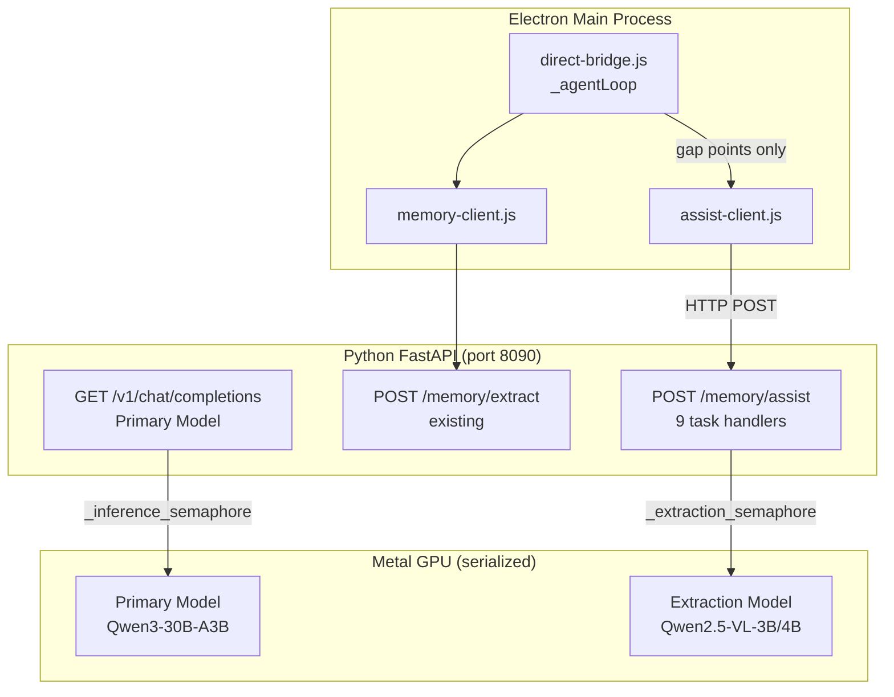

# Design Document: Dual-Model Fast Assistant

## Overview

The dual-model fast assistant leverages the existing secondary extraction model (already loaded in `_extract_model` / `_extract_processor` within `memory-bridge.py`) to handle nine categories of lightweight tasks in the gaps between primary model inference turns. The design is purely additive: no new processes, no new IPC channels, no changes to the primary model's behavior.

The feature introduces three new artifacts:
1. `POST /memory/assist` — a new FastAPI endpoint in `memory-bridge.py` that routes tasks to the extraction model
2. `assist-client.js` — a new CommonJS module (mirroring `memory-client.js`) that wraps the HTTP endpoint
3. Integration hooks in `direct-bridge.js` `_agentLoop()` at nine defined gap points

When no extraction model is loaded, every assist call returns `null` / HTTP 503 and the agent loop proceeds exactly as today.

---

## Architecture



**Key constraint**: MLX serializes all Metal GPU operations. The `_extraction_semaphore` (concurrency=1, lazy-initialized) already gates the extraction model. The `_inference_semaphore` in `server.py` gates the primary model. These two semaphores are independent — no deadlock is possible because assist tasks only run at gap points when the primary model is not holding its semaphore.

### Gap Scheduling

The nine assist tasks fire at these specific points in `_agentLoop()`:

| Gap Point | Task(s) | Blocking? |
|-----------|---------|-----------|
| Before first Primary_Model call | `todo_bootstrap`, `vision` (if images present) | Non-blocking (fire-and-forget for bootstrap; awaited for vision before dispatch) |
| After tool result received | `todo_watch`, `fetch_summarize`, `git_summarize`, `rank_search`, `extract_section` | Non-blocking for watch; awaited for the rest before appending to messages |
| Before tool execution | `tool_validate` | Awaited (blocking, 10s timeout) |
| After tool error | `error_diagnose` | Awaited (blocking, 15s timeout) |
| After Primary_Model text response | `detect_repetition` | Non-blocking (fire-and-forget) |

---

## Components and Interfaces

### 1. `POST /memory/assist` (memory-bridge.py)

New FastAPI endpoint added to the existing `router` (`prefix="/memory"`).

**Request model:**
```python
class AssistRequest(BaseModel):
    task_type: str   # one of 9 valid values
    payload: dict    # task-specific fields
    timeout_ms: Optional[int] = 60000
```

**Response model:**
```python
class AssistResponse(BaseModel):
    result: Optional[str] = None      # text output
    result_data: Optional[Any] = None # structured output (todos, ranked list, validation)
    elapsed_ms: int
    output_tokens: int
```

**Degraded response (HTTP 503):**
```json
{"degraded": true, "reason": "no extraction model loaded"}
```

**Routing table** — the endpoint dispatches `task_type` to one of nine internal handler functions:

| `task_type` | Handler | Input fields | Output |
|-------------|---------|-------------|--------|
| `vision` | `_handle_vision` | `image_b64`, `mime_type`, `prompt` | `result` (text description) |
| `todo_bootstrap` | `_handle_todo_bootstrap` | `user_prompt` | `result_data` (todo array) |
| `todo_watch` | `_handle_todo_watch` | `tool_name`, `tool_result`, `current_todos` | `result_data` (updated todo array or null) |
| `fetch_summarize` | `_handle_fetch_summarize` | `url`, `raw_content`, `max_output_tokens` | `result` (summary text) |
| `tool_validate` | `_handle_tool_validate` | `tool_name`, `tool_args`, `recent_context` | `result_data` (`{valid, reason?}`) |
| `error_diagnose` | `_handle_error_diagnose` | `tool_name`, `tool_args`, `error_message`, `recent_context` | `result` (one-sentence diagnosis) |
| `git_summarize` | `_handle_git_summarize` | `command`, `raw_output` | `result` (summary text) |
| `rank_search` | `_handle_rank_search` | `pattern`, `results`, `task_context` | `result_data` (ranked string array) |
| `extract_section` | `_handle_extract_section` | `file_path`, `file_content`, `task_context` | `result` (extracted section) |
| `detect_repetition` | `_handle_detect_repetition` | `recent_responses` | `result_data` (`{repeating, reason?}`) |

**Semaphore reuse pattern** (identical to existing `_get_extraction_semaphore()`):
```python
async def _assist_with_semaphore(handler_coro):
    async with _get_extraction_semaphore():
        return await handler_coro
```

The endpoint wraps every handler call in `_assist_with_semaphore`. This reuses the same semaphore already used by `/memory/extract`, ensuring the extraction model is never called concurrently with itself or with the primary model's extraction path.

**Timeout enforcement:**
```python
try:
    result = await asyncio.wait_for(
        _assist_with_semaphore(handler_coro),
        timeout=60.0
    )
except asyncio.TimeoutError:
    raise HTTPException(status_code=504, detail="Assist task timed out")
```

### 2. `assist-client.js`

New CommonJS module. Mirrors `memory-client.js` in structure: uses Node.js built-in `http`, catches all errors internally, returns `null` on any failure.

**Exported constants:**
```js
const FETCH_SUMMARIZE_THRESHOLD = 4000   // chars
const VISION_MAX_CHARS = 2000            // chars (~500 tokens)
const GIT_SUMMARIZE_THRESHOLD = 2000     // chars
const SEARCH_RANK_THRESHOLD = 15         // result count
const FILE_EXTRACT_THRESHOLD = 8000      // chars
const TODO_BOOTSTRAP_ENABLED = true
const TODO_WATCH_ENABLED = true
const ASSIST_TIMEOUT_MS = 65000          // 5s longer than server timeout
```

**Exported functions:**
```js
async function assistVision(imageData, mimeType, prompt)
  // Returns: string | null

async function assistTodoBootstrap(userPrompt)
  // Returns: Array<{id, content, status}> | null

async function assistTodoWatch(toolName, toolResult, currentTodos)
  // Returns: Array<{id, content, status}> | null

async function assistFetchSummarize(url, rawContent, maxOutputTokens)
  // Returns: string | null

async function assistValidateTool(toolName, toolArgs, recentContext)
  // Returns: {valid: boolean, reason?: string} | null

async function assistDiagnoseError(toolName, toolArgs, errorMessage, recentContext)
  // Returns: string | null

async function assistGitSummarize(command, rawOutput)
  // Returns: string | null

async function assistRankSearchResults(pattern, results, taskContext)
  // Returns: string[] | null

async function assistExtractRelevantSection(filePath, fileContent, taskContext)
  // Returns: string | null

async function assistDetectRepetition(recentResponses)
  // Returns: {repeating: boolean, reason?: string} | null
```

All functions share a single internal `_assistRequest(taskType, payload, timeoutMs)` helper that:
1. POSTs to `${BASE_URL}/memory/assist`
2. On HTTP 503 with `degraded: true` → returns `null` (no warning logged)
3. On any other error → logs `[assist-client] warn: ${taskType} failed: ${reason}` and returns `null`
4. On success → returns the parsed response

### 3. `direct-bridge.js` Integration Points

`assist-client.js` is loaded with the same lazy-require pattern as `memory-client.js`:

```js
let assistClient = null
try {
  assistClient = require('./assist-client.js')
} catch (_) {}
```

**Integration point 1 — Vision offload** (before first LLM call, and after `browser_screenshot`):
```js
// In the messages preprocessing block, before _streamCompletion
if (assistClient) {
  for (const msg of messages) {
    if (!Array.isArray(msg.content)) continue
    for (let i = 0; i < msg.content.length; i++) {
      const part = msg.content[i]
      if (part.type === 'image_url' || part.type === 'image') {
        const desc = await assistClient.assistVision(part.image_url?.url || part.source?.data, ...)
        if (desc) msg.content[i] = { type: 'text', text: `[Vision: ${desc}]` }
      }
    }
  }
}
```

**Integration point 2 — Todo bootstrap** (before first LLM call, non-blocking):
```js
// Fire-and-forget before first _streamCompletion call
let _bootstrapDone = false
if (assistClient && TODO_BOOTSTRAP_ENABLED && turn === 0) {
  const userPrompt = messages.filter(m => m.role === 'user').pop()?.content || ''
  assistClient.assistTodoBootstrap(userPrompt).then(todos => {
    if (todos && !_bootstrapDone) {
      this.send('qwen-event', { type: 'tool_result', tool: 'update_todos', result: { todos } })
    }
  }).catch(() => {})
}
```

**Integration point 3 — Todo watch** (after each tool result, fire-and-forget):
```js
if (assistClient && TODO_WATCH_ENABLED && _lastTodos) {
  assistClient.assistTodoWatch(fnName, content, _lastTodos).then(updated => {
    if (updated && hasStatusChanges(updated, _lastTodos)) {
      this.send('qwen-event', { type: 'tool_result', tool: 'update_todos', result: { todos: updated } })
    }
  }).catch(() => {})
}
```

**Integration point 4 — Fetch summarize** (after `web_fetch` tool result):
```js
if (assistClient && fnName === 'web_fetch' && content.length > FETCH_SUMMARIZE_THRESHOLD) {
  const summary = await assistClient.assistFetchSummarize(fnArgs.url, content, 512)
  if (summary) content = `[Summarized by fast model — original: ${content.length} chars]\n\n${summary}`
}
```

**Integration point 5 — Tool validate** (before tool execution, awaited):
```js
if (assistClient && VALIDATED_TOOLS.has(fnName)) {
  const validation = await assistClient.assistValidateTool(fnName, fnArgs, recentContext)
  if (validation && !validation.valid) {
    messages.push({ role: 'system', content: `Tool call rejected: ${validation.reason}` })
    continue  // re-prompt primary model
  }
}
```

**Integration point 6 — Error diagnose** (after tool error, awaited):
```js
if (assistClient && isError) {
  const diagnosis = await assistClient.assistDiagnoseError(fnName, fnArgs, content, recentContext)
  if (diagnosis) content = `[Fast model diagnosis: ${diagnosis}]\n\n${content}`
}
```

**Integration point 7 — Git summarize** (after bash tool result matching git commands):
```js
const GIT_CMD_RE = /^git\s+(status|log|diff|show)\b/
if (assistClient && fnName === 'bash' && GIT_CMD_RE.test(fnArgs.command || '') && content.length > GIT_SUMMARIZE_THRESHOLD) {
  const summary = await assistClient.assistGitSummarize(fnArgs.command, content)
  if (summary) content = `[Git summary by fast model — original: ${content.length} chars]\n\n${summary}`
}
```

**Integration point 8 — Search rank** (after `search_files` result):
```js
if (assistClient && fnName === 'search_files') {
  const lines = content.split('\n').filter(Boolean)
  if (lines.length > SEARCH_RANK_THRESHOLD) {
    const ranked = await assistClient.assistRankSearchResults(fnArgs.pattern, lines, taskContext)
    if (ranked) content = `[Ranked by fast model — showing 15 of ${lines.length} matches]\n\n${ranked.slice(0, 15).join('\n')}`
  }
}
```

**Integration point 9 — File extract** (after `read_file` result):
```js
if (assistClient && fnName === 'read_file' && content.length > FILE_EXTRACT_THRESHOLD && taskContext) {
  const section = await assistClient.assistExtractRelevantSection(fnArgs.path, content, taskContext)
  if (section) content = `[Relevant section extracted by fast model — file: ${content.length} chars total]\n\n${section}`
}
```

**Integration point 10 — Repetition detect** (after each text response, fire-and-forget):
```js
if (assistClient && text) {
  lastTextResponses.push(text.slice(0, 500))
  if (lastTextResponses.length > 3) lastTextResponses.shift()
  if (lastTextResponses.length >= 2) {
    assistClient.assistDetectRepetition(lastTextResponses).then(result => {
      if (result?.repeating) {
        // inject system message and trigger existing loop-breaking logic
      }
    }).catch(() => {})
  }
}
```

---

## Data Models

### AssistRequest (Python Pydantic)
```python
class AssistRequest(BaseModel):
    task_type: Literal[
        "vision", "todo_bootstrap", "todo_watch", "fetch_summarize",
        "tool_validate", "error_diagnose", "git_summarize",
        "rank_search", "extract_section", "detect_repetition"
    ]
    payload: dict
    timeout_ms: Optional[int] = 60000
```

### AssistResponse (Python Pydantic)
```python
class AssistResponse(BaseModel):
    result: Optional[str] = None
    result_data: Optional[Any] = None
    elapsed_ms: int
    output_tokens: int
```

### Todo item (shared JS/Python shape)
```js
{ id: number, content: string, status: "pending" | "in_progress" | "done" }
```

### Validation result (JS)
```js
{ valid: boolean, reason?: string }
```

### Repetition result (JS)
```js
{ repeating: boolean, reason?: string }
```

### GET /memory/status extension
The existing `MemoryStatus` Pydantic model gains one field:
```python
class MemoryStatus(BaseModel):
    # ... existing fields ...
    fast_assistant_enabled: bool  # true when _extract_model is not None
```

---

## Correctness Properties

*A property is a characteristic or behavior that should hold true across all valid executions of a system — essentially, a formal statement about what the system should do. Properties serve as the bridge between human-readable specifications and machine-verifiable correctness guarantees.*

### Property 1: Invalid task_type always returns 400

*For any* string that is not a member of the valid `task_type` set (`{"vision", "todo_bootstrap", "todo_watch", "fetch_summarize", "tool_validate", "error_diagnose", "git_summarize", "rank_search", "extract_section", "detect_repetition"}`), a POST to `/memory/assist` with that string as `task_type` SHALL return HTTP 400.

**Validates: Requirements 1.4**

---

### Property 2: Assist client returns null for any HTTP error

*For any* HTTP status code in the 4xx or 5xx range returned by the assist endpoint, `_assistRequest()` SHALL return `null` without throwing an exception.

**Validates: Requirements 2.3, 8.5**

---

### Property 3: All capabilities degrade to null when no extraction model is loaded

*For any* of the ten assist functions (`assistVision`, `assistTodoBootstrap`, `assistTodoWatch`, `assistFetchSummarize`, `assistValidateTool`, `assistDiagnoseError`, `assistGitSummarize`, `assistRankSearchResults`, `assistExtractRelevantSection`, `assistDetectRepetition`), when the extraction model is not loaded (endpoint returns HTTP 503 with `degraded: true`), the function SHALL return `null`.

**Validates: Requirements 8.1, 8.5, 17.4**

---

### Property 4: Vision replacement preserves message structure

*For any* messages array containing N image content parts and any N non-null description strings returned by `assistVision`, after processing: (a) the messages array has the same length, (b) each image part is replaced by a text part, (c) each replacement text starts with `[Vision: ` and ends with `]`, and (d) the replacement text length does not exceed `VISION_MAX_CHARS`.

**Validates: Requirements 3.3, 3.7**

---

### Property 5: Fetch summarize threshold is respected in both directions

*For any* string `s`: if `s.length > FETCH_SUMMARIZE_THRESHOLD` then `assistFetchSummarize` SHALL be called; if `s.length <= FETCH_SUMMARIZE_THRESHOLD` then `assistFetchSummarize` SHALL NOT be called.

**Validates: Requirements 6.1, 6.7**

---

### Property 6: Todo watch only changes status, never content or count

*For any* input todo list `T` and any non-null output todo list `T'` returned by the `todo_watch` handler: `T'` has the same length as `T`, each item in `T'` has the same `id` and `content` as the corresponding item in `T`, and the only field that may differ is `status` (and only in the direction `"pending"` → `"in_progress"` or `"in_progress"` → `"done"`).

**Validates: Requirements 5.7**

---

### Property 7: Tool validation rejection prevents tool execution

*For any* tool name in `{edit_file, write_file, bash, read_file}` and any `{valid: false, reason: string}` response from `assistValidateTool`, the tool SHALL NOT be executed and a system message containing the `reason` SHALL be injected into the messages array.

**Validates: Requirements 11.3**

---

### Property 8: Validation is skipped for non-validated tools

*For any* tool name NOT in `{edit_file, write_file, bash, read_file}`, `assistValidateTool` SHALL NOT be called.

**Validates: Requirements 11.7**

---

### Property 9: Error diagnosis format is always correct

*For any* non-null diagnosis string `d` returned by `assistDiagnoseError`, the tool result content SHALL be `[Fast model diagnosis: ${d}]\n\n${originalError}` — i.e., the diagnosis is prepended, not appended, and the original error is preserved in full.

**Validates: Requirements 12.2**

---

### Property 10: Git summarize threshold is respected

*For any* bash command matching `/^git\s+(status|log|diff|show)\b/` and output string `s`: if `s.length > GIT_SUMMARIZE_THRESHOLD` then `assistGitSummarize` SHALL be called; if `s.length <= GIT_SUMMARIZE_THRESHOLD` then `assistGitSummarize` SHALL NOT be called.

**Validates: Requirements 13.1**

---

### Property 11: Search ranking threshold is respected

*For any* `search_files` result array `R`: if `R.length > SEARCH_RANK_THRESHOLD` then `assistRankSearchResults` SHALL be called; if `R.length <= SEARCH_RANK_THRESHOLD` then `assistRankSearchResults` SHALL NOT be called.

**Validates: Requirements 14.1**

---

### Property 12: File extract threshold is respected

*For any* `read_file` result string `s` and non-empty task context: if `s.length > FILE_EXTRACT_THRESHOLD` then `assistExtractRelevantSection` SHALL be called; if `s.length <= FILE_EXTRACT_THRESHOLD` then `assistExtractRelevantSection` SHALL NOT be called.

**Validates: Requirements 15.1**

---

## Error Handling

**Extraction model not loaded** — All nine handlers check `_extract_model is None` at the top and return HTTP 503 with `{"degraded": true, "reason": "no extraction model loaded"}`. The assist client treats this as a normal no-op.

**Extraction model unloaded mid-session** — Because each handler checks `_extract_model` at call time (not at session start), unloading mid-session is handled automatically. Subsequent calls degrade gracefully.

**Timeout (server-side, 60s)** — `asyncio.wait_for` wraps the semaphore-gated handler call. On timeout, HTTP 504 is returned. The assist client has a 65s client-side timeout as a backstop.

**Timeout (client-side, per-function)** — `assistValidateTool` uses a 10s timeout; `assistDiagnoseError` uses 15s; `assistExtractRelevantSection` uses 20s; all others use the default 65s. These are enforced in `_assistRequest` via the Node.js `http` socket timeout.

**Semaphore contention** — If the primary model is running (holding `_inference_semaphore` in `server.py`), assist requests queue behind `_extraction_semaphore`. They will be processed as soon as the primary model's turn completes. No deadlock is possible because the two semaphores are independent.

**Malformed model output** — Each handler wraps the `mlx_lm.generate` call and JSON parsing in try/except. On any parse failure, the handler returns a safe default (empty result or null) rather than propagating the error.

**Secret filtering** — The `_fail_closed_filter` is applied to all text payloads before they are passed to the extraction model, consistent with the existing extraction pipeline.

---

## Testing Strategy

### Unit Tests (`test/assist-client.test.js`)

Example-based tests covering:
- Module exports all 10 functions and all 7 constants
- `_assistRequest` returns `null` on HTTP 503 with `degraded: true`
- `_assistRequest` returns `null` on network error (ECONNREFUSED)
- `_assistRequest` returns `null` on HTTP 500
- `assistFetchSummarize` returns `null` when content ≤ `FETCH_SUMMARIZE_THRESHOLD`
- `assistValidateTool` returns `null` for tools not in the validated set
- Warning is logged exactly once on failure (not on degraded)

### Property Tests (`test/assist-client.property.test.js`)

Using `fast-check` v4, 150 runs each:

```js
// Property 1: Invalid task_type → 400
fc.assert(fc.asyncProperty(
  fc.string().filter(s => !VALID_TASK_TYPES.has(s)),
  async (taskType) => {
    const res = await mockPost('/memory/assist', { task_type: taskType, payload: {} })
    return res.status === 400
  }
), { numRuns: 150 })
// Feature: dual-model-fast-assistant, Property 1: Invalid task_type always returns 400

// Property 2: Any HTTP error → null
fc.assert(fc.asyncProperty(
  fc.integer({ min: 400, max: 599 }),
  async (statusCode) => {
    const result = await assistClientWithMockServer(statusCode)
    return result === null
  }
), { numRuns: 150 })
// Feature: dual-model-fast-assistant, Property 2: Assist client returns null for any HTTP error

// Property 3: Degraded mode → null for all functions
fc.assert(fc.asyncProperty(
  fc.constantFrom(...ALL_ASSIST_FUNCTIONS),
  async (fn) => {
    const result = await fn(/* mock 503 degraded */)
    return result === null
  }
), { numRuns: 150 })
// Feature: dual-model-fast-assistant, Property 3: All capabilities degrade to null

// Property 4: Vision replacement preserves structure
fc.assert(fc.asyncProperty(
  fc.array(fc.record({ type: fc.constant('image_url'), image_url: fc.record({ url: fc.string() }) }), { minLength: 1, maxLength: 5 }),
  fc.array(fc.string({ minLength: 1, maxLength: VISION_MAX_CHARS }), { minLength: 1, maxLength: 5 }),
  async (imageParts, descriptions) => {
    const result = applyVisionReplacements(imageParts, descriptions)
    return result.every((p, i) =>
      p.type === 'text' &&
      p.text.startsWith('[Vision: ') &&
      p.text.endsWith(']') &&
      p.text.length <= VISION_MAX_CHARS + '[Vision: ]'.length
    )
  }
), { numRuns: 150 })
// Feature: dual-model-fast-assistant, Property 4: Vision replacement preserves message structure

// Property 5: Fetch summarize threshold
fc.assert(fc.asyncProperty(
  fc.string(),
  async (content) => {
    const called = trackAssistFetchSummarizeCalls(content)
    return content.length > FETCH_SUMMARIZE_THRESHOLD ? called : !called
  }
), { numRuns: 150 })
// Feature: dual-model-fast-assistant, Property 5: Fetch summarize threshold is respected

// Property 6: Todo watch only changes status
fc.assert(fc.asyncProperty(
  fc.array(fc.record({ id: fc.nat(), content: fc.string(), status: fc.constantFrom('pending', 'in_progress', 'done') }), { minLength: 1, maxLength: 10 }),
  fc.array(fc.record({ id: fc.nat(), content: fc.string(), status: fc.constantFrom('pending', 'in_progress', 'done') }), { minLength: 1, maxLength: 10 }),
  (input, output) => {
    if (input.length !== output.length) return true // skip mismatched lengths
    return output.every((item, i) =>
      item.id === input[i].id &&
      item.content === input[i].content
    )
  }
), { numRuns: 150 })
// Feature: dual-model-fast-assistant, Property 6: Todo watch only changes status

// Property 7: Validation rejection prevents execution
fc.assert(fc.asyncProperty(
  fc.constantFrom('edit_file', 'write_file', 'bash', 'read_file'),
  fc.string({ minLength: 1 }),
  async (toolName, reason) => {
    const { executed, systemMessageInjected } = await simulateValidationRejection(toolName, reason)
    return !executed && systemMessageInjected
  }
), { numRuns: 150 })
// Feature: dual-model-fast-assistant, Property 7: Tool validation rejection prevents execution

// Property 8: Non-validated tools skip validation
fc.assert(fc.asyncProperty(
  fc.string().filter(s => !VALIDATED_TOOLS.has(s)),
  async (toolName) => {
    const called = trackValidateCalls(toolName)
    return !called
  }
), { numRuns: 150 })
// Feature: dual-model-fast-assistant, Property 8: Validation skipped for non-validated tools

// Property 9: Error diagnosis format
fc.assert(fc.asyncProperty(
  fc.string({ minLength: 1 }),
  fc.string({ minLength: 1 }),
  (diagnosis, originalError) => {
    const result = applyDiagnosisFormat(diagnosis, originalError)
    return result === `[Fast model diagnosis: ${diagnosis}]\n\n${originalError}`
  }
), { numRuns: 150 })
// Feature: dual-model-fast-assistant, Property 9: Error diagnosis format is always correct

// Properties 10-12: threshold properties (same pattern as Property 5)
```

### Integration Tests

- End-to-end: load a real Qwen2.5-VL-3B model, POST to `/memory/assist` with each task type, verify response shape
- Semaphore serialization: two concurrent assist requests complete sequentially (no overlap in timing)
- Degraded mode: unload extraction model, verify all 10 client functions return null

### Python Unit Tests (`test/test_memory_bridge_assist.py`)

- Each handler returns correct response shape when model is mocked
- `_get_extraction_semaphore()` returns the same instance on repeated calls (lazy-init idempotence)
- Timeout enforcement: handler that sleeps 61s returns HTTP 504
- Secret filtering applied to payload before model invocation
