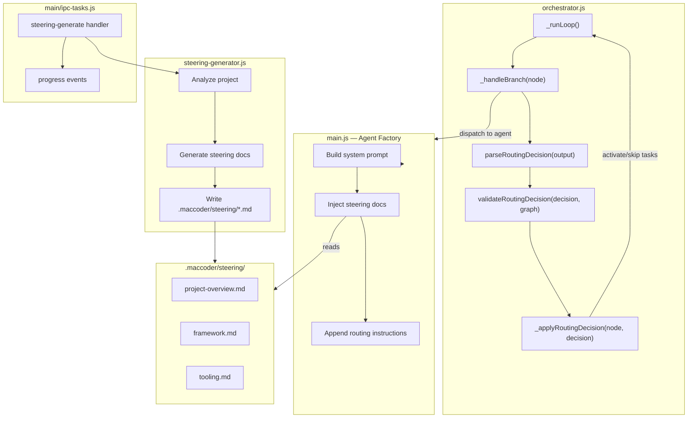

# Design Document: Dynamic Routing and Skills

## Overview

This feature adds two capabilities to the QwenCoder Mac Studio IDE:

1. **Dynamic Branch Routing** — Upgrades the orchestrator to parse structured `RoutingDecision` JSON objects from agent output at branch points, enabling conditional workflows, retry loops, and parallel fan-out patterns. Currently, branch evaluation uses a simple `_evaluateCondition` method that checks context keys and boolean literals. The new system dispatches branch point tasks to agents, parses their structured output, and routes execution accordingly.

2. **Auto-Generating Steering Docs** — A `SteeringGenerator` module that uses an explore-type agent to analyze the project codebase and produce `.maccoder/steering/*.md` files. These steering docs contain project-specific context (tech stack, conventions, framework patterns, tooling) and are automatically injected into agent system prompts via the `AgentFactory`, grounding all future agent runs in project context.

Both capabilities integrate into the existing architecture: the orchestrator loop in `orchestrator.js`, the agent dispatch system in `agent-pool.js`, the agent factory in `main.js`, and the IPC layer in `main/ipc-tasks.js`.

## Architecture



### Design Decisions

1. **Routing parsing lives in orchestrator.js** — The `parseRoutingDecision` and `validateRoutingDecision` functions are pure functions in `orchestrator.js` (or a co-located module). This keeps routing logic testable and close to where it's consumed. The orchestrator's `_handleBranch` method is refactored to dispatch the branch task to an agent first, then parse the output.

2. **Steering generator is a separate module** — `steering-generator.js` is a new top-level module. It uses the `AgentPool` to dispatch an explore-type agent, then parses the agent's output to produce steering doc files. This keeps the generation logic decoupled from the IPC layer.

3. **Steering injection happens in the agent factory** — The agent factory in `main.js` is the single point where system prompts are assembled. Steering docs are loaded and injected here, after the base prompt and before task-specific instructions (routing instructions for branch points).

4. **Fallback-first routing** — If routing decision parsing fails for any reason (no JSON found, invalid format, missing task IDs), the orchestrator falls back to the existing `_evaluateCondition` logic. This ensures backward compatibility with existing task graphs.

## Components and Interfaces

### 1. Routing Decision Parser (`orchestrator.js`)

**`parseRoutingDecision(agentOutput: string): RoutingDecision | null`**

Extracts a `RoutingDecision` JSON object from agent output text. Searches for a JSON object containing a `route` key, even if embedded in surrounding markdown or prose. Returns `null` if no valid JSON with a `route` key is found.

Implementation approach:
- Use a regex to find JSON-like blocks (`{...}`) in the output
- Attempt `JSON.parse` on each candidate
- Return the first parsed object that has a `route` property
- Return `null` on any failure (no match, parse error, missing `route`)

**`validateRoutingDecision(decision: RoutingDecision, graph: TaskGraph): { valid: boolean, errors: string[] }`**

Validates that all task IDs in the routing decision exist in the task graph and that the route is non-empty.

- If `route` is a string: validate it's non-empty and exists in `graph.nodes`
- If `route` is an array: validate it's non-empty and every element exists in `graph.nodes`
- Returns `{ valid: true, errors: [] }` or `{ valid: false, errors: [...] }`

### 2. Orchestrator Branch Handling (refactored `_handleBranch`)

The existing `_handleBranch` method is refactored:

```
_handleBranch(node):
  1. Mark node as in_progress
  2. Dispatch node to agent pool (agent gets routing instructions in prompt)
  3. Parse agent output with parseRoutingDecision()
  4. If valid routing decision:
     a. Store reason in _context if present
     b. Activate routed task(s) — set to not_started
     c. Skip sibling tasks not in the route
     d. Mark branch node as completed
  5. If invalid/missing routing decision:
     a. Fall back to _evaluateCondition(node.markers.branch)
     b. Existing behavior applies
```

**`_applyRoutingDecision(branchNode, decision)`**

Applies a validated routing decision:
- For single route: mark target as `not_started`, skip non-selected siblings
- For array route (fan-out): mark all targets as `not_started`, skip non-selected siblings
- For retry (routing to a completed task): reset target to `not_started`

**`_getRoutableSiblings(branchNode): string[]`**

Returns the list of task IDs that a branch point can route to. These are the sibling tasks (same parent, same depth) that come after the branch node in the graph, plus direct children of the branch node.

### 3. Agent Prompt Augmentation (`main.js`)

The agent factory is extended:

**Steering doc injection:**
```
1. Read all .md files from .maccoder/steering/ (if directory exists)
2. Parse YAML front matter from each file
3. Append to system prompt under "## Project Context" header
4. Each doc gets a "### <name>" sub-header
```

**Branch point routing instructions:**
```
1. Detect if task has markers.branch set
2. Get routable sibling/child task IDs from the task graph
3. Append routing instruction block to system prompt:
   - Explain the RoutingDecision JSON format
   - List valid downstream task IDs with their titles
   - Include an example JSON
```

### 4. Steering Generator (`steering-generator.js`)

**`generateSteeringDocs(projectDir: string, agentPool: AgentPool): Promise<SteeringResult>`**

Orchestrates the full generation flow:

1. Dispatch an explore-type agent to analyze the project
2. Parse the agent's output to extract project context
3. Generate steering doc content for each applicable category:
   - `project-overview.md` — always generated
   - `<framework>.md` — if a recognizable framework is detected
   - `tooling.md` — if tool config files are found
4. Write files to `.maccoder/steering/`
5. Emit progress events during generation

**`parseSteeringDoc(content: string): { frontMatter: object, body: string }`**

Parses a steering doc file into its YAML front matter and markdown body.

**`printSteeringDoc(frontMatter: object, body: string): string`**

Serializes a steering doc back to its file format (YAML front matter + markdown body).

### 5. IPC Handlers (`main/ipc-tasks.js`)

New IPC handlers:

- `steering-generate` — Accepts `{ projectDir }`, invokes `generateSteeringDocs`, returns `{ ok: true }` or `{ error }`. Emits `steering-progress` events to the renderer.
- `steering-status` — Returns whether steering docs exist for the current project.

### 6. Steering Doc Loader (`steering-loader.js`)

**`loadSteeringDocs(projectDir: string): SteeringDoc[]`**

Reads all `.md` files from `.maccoder/steering/`, parses front matter, and returns an array of `SteeringDoc` objects. Used by the agent factory at prompt assembly time.

**`formatSteeringForPrompt(docs: SteeringDoc[]): string`**

Formats loaded steering docs into a prompt-injectable string with `## Project Context` header and per-doc sub-headers.

## Data Models

### RoutingDecision

```javascript
{
  route: string | string[],  // Single task ID or array for fan-out
  reason: string | undefined  // Optional explanation stored in context
}
```

### SteeringDoc

```javascript
{
  name: string,           // e.g. "project-overview"
  description: string,    // Human-readable description
  autoGenerated: boolean, // true when produced by SteeringGenerator
  body: string            // Markdown content
}
```

### SteeringDoc File Format

```markdown
---
name: project-overview
description: Auto-generated project overview with tech stack and structure
auto_generated: true
---

## Tech Stack

- Runtime: Node.js with Electron
- ...
```

### SteeringResult

```javascript
{
  projectDir: string,
  docsGenerated: string[],  // filenames written
  errors: string[]          // any generation errors
}
```

### ValidationResult (for routing)

```javascript
{
  valid: boolean,
  errors: string[]  // e.g. ["Task ID 'xyz' not found in graph"]
}
```


## Correctness Properties

*A property is a characteristic or behavior that should hold true across all valid executions of a system — essentially, a formal statement about what the system should do. Properties serve as the bridge between human-readable specifications and machine-verifiable correctness guarantees.*

### Property 1: Routing decision extraction from embedded text

*For any* agent output string that contains a valid JSON object with a `route` field (either a string or an array of strings) embedded within arbitrary surrounding text, `parseRoutingDecision` SHALL extract and return a `RoutingDecision` object whose `route` value matches the embedded JSON's `route` value.

**Validates: Requirements 1.1, 1.2, 4.1**

### Property 2: Invalid input yields null

*For any* string that does not contain a valid JSON object with a `route` key (including malformed JSON, JSON without a `route` field, empty strings, and random text), `parseRoutingDecision` SHALL return `null`.

**Validates: Requirements 1.4, 4.5**

### Property 3: Route validation accepts existing IDs and rejects missing IDs

*For any* `RoutingDecision` and `TaskGraph`, `validateRoutingDecision` SHALL return `{ valid: true }` if and only if the `route` is non-empty and every task ID in the route exists in the graph's nodes. It SHALL return `{ valid: false }` with descriptive errors otherwise.

**Validates: Requirements 2.3, 4.2, 4.3, 4.4**

### Property 4: Route application activates all target tasks

*For any* valid `RoutingDecision` (single string or array) applied to a `TaskGraph` with a branch point, all task IDs specified in the `route` SHALL have their status set to `not_started` after application, regardless of their previous status.

**Validates: Requirements 2.1, 2.2, 2.4**

### Property 5: Non-selected siblings are skipped

*For any* branch point node in a `TaskGraph` with routable siblings, when a `RoutingDecision` selects a subset of those siblings, all sibling tasks NOT in the route SHALL be marked as `skipped`.

**Validates: Requirements 2.5**

### Property 6: Routing instructions contain all routable task IDs

*For any* branch point node in a `TaskGraph`, the generated routing instructions string SHALL contain every task ID returned by `_getRoutableSiblings(branchNode)`.

**Validates: Requirements 3.2**

### Property 7: Steering doc serialization round-trip

*For any* valid `SteeringDoc` object (with non-empty `name`, `description`, `autoGenerated` boolean, and markdown `body`), serializing with `printSteeringDoc` then parsing with `parseSteeringDoc` SHALL produce an equivalent `SteeringDoc` object.

**Validates: Requirements 6.4**

### Property 8: Steering doc prompt injection completeness

*For any* non-empty array of `SteeringDoc` objects, `formatSteeringForPrompt` SHALL produce a string that contains every doc's `name` as a sub-header and every doc's `body` content.

**Validates: Requirements 7.1, 7.2**

## Error Handling

### Routing Decision Errors

| Error Condition | Handling |
|---|---|
| Agent output contains no JSON | `parseRoutingDecision` returns `null` → fallback to `_evaluateCondition` |
| JSON found but no `route` key | `parseRoutingDecision` returns `null` → fallback |
| `JSON.parse` throws | Caught internally, returns `null` → fallback |
| `route` is empty string or empty array | `validateRoutingDecision` returns `{ valid: false }` → fallback |
| `route` contains non-existent task ID | `validateRoutingDecision` returns `{ valid: false }` → emit `task-error`, mark branch as `failed` |
| Multiple JSON objects in output | First valid one with `route` key wins |

### Steering Doc Errors

| Error Condition | Handling |
|---|---|
| `.maccoder/steering/` directory doesn't exist | `loadSteeringDocs` returns empty array; agent factory skips injection |
| Steering doc has malformed YAML front matter | Skip that doc, log warning, continue with remaining docs |
| Agent pool dispatch fails during generation | `generateSteeringDocs` returns `{ errors: [...] }` with the failure message |
| File write fails during generation | Error added to `SteeringResult.errors`, generation continues for remaining docs |
| Project directory doesn't exist | `generateSteeringDocs` throws immediately with descriptive error |

### Orchestrator State Errors

| Error Condition | Handling |
|---|---|
| Branch dispatch to agent fails | `_handleBranch` catches error, marks branch as `failed`, pauses orchestrator |
| Routing to non-existent task after validation passes (race) | Defensive check in `_applyRoutingDecision`, emit `task-error` |

## Testing Strategy

### Property-Based Tests (fast-check)

The project uses Node.js built-in test runner (`node:test`) with `fast-check` for property-based testing. Each property from the Correctness Properties section maps to a single property-based test with a minimum of 100 iterations.

**Test file: `test/routing-decision.property.test.js`**
- Property 1: Routing decision extraction — generate random text wrapping valid RoutingDecision JSON
- Property 2: Invalid input yields null — generate random strings without valid RoutingDecision JSON
- Property 3: Route validation — generate random TaskGraphs and RoutingDecisions, verify validation correctness
- Property 4: Route application — generate random graphs with branch points and valid routes, verify target activation
- Property 5: Non-selected siblings skipped — generate random graphs with multiple siblings, apply partial routes
- Property 6: Routing instructions contain IDs — generate random graphs with branch points, verify instruction content

**Test file: `test/steering-doc.property.test.js`**
- Property 7: Steering doc round-trip — generate random SteeringDoc objects, verify serialize/parse round-trip
- Property 8: Prompt injection completeness — generate random SteeringDoc arrays, verify formatted output

### Unit Tests (example-based)

**Test file: `test/routing-decision.test.js`**
- Parse a clean RoutingDecision JSON string (no surrounding text)
- Parse RoutingDecision embedded in markdown code block
- Parse RoutingDecision with `reason` field, verify reason is preserved
- Validate route with existing task ID → valid
- Validate route with non-existent task ID → invalid with error message
- Validate empty string route → invalid
- Validate empty array route → invalid
- Apply single route: target set to not_started, branch marked completed
- Apply fan-out route: all targets set to not_started
- Apply route to completed task (retry): task reset to not_started
- Fallback to `_evaluateCondition` when no RoutingDecision found
- Branch point prompt includes example JSON and valid task IDs

**Test file: `test/steering-generator.test.js`**
- Generate steering docs for a mock project with package.json → project-overview.md created
- Generate steering docs for Electron project → framework doc created
- Generate steering docs with ESLint config → tooling.md created
- Regenerate overwrites existing docs
- No steering docs → agent factory prompt unchanged
- Steering docs injected in correct order (after base prompt, before routing instructions)

**Test file: `test/steering-doc.test.js`**
- Parse steering doc with valid YAML front matter
- Parse steering doc with missing fields → graceful handling
- Format empty steering doc array → empty string
- Format single doc → contains `## Project Context` and `### <name>` headers

### Integration Tests

- End-to-end: orchestrator executes a task graph with a branch point, agent returns RoutingDecision, correct path is followed
- IPC `steering-generate` handler invokes generator and returns result
- Progress events emitted during steering generation
