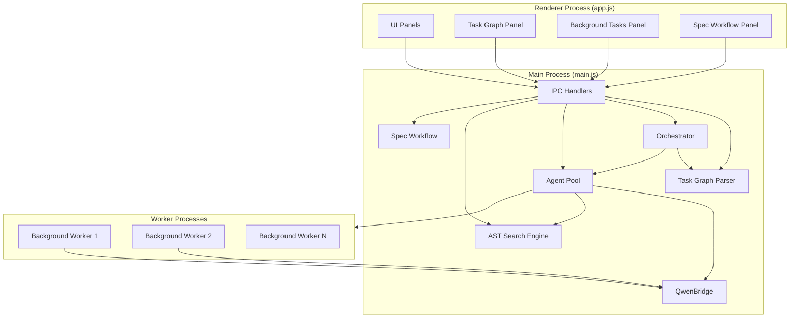

# Design Document: oh-my-maccoder-integration

## Overview

This design integrates oh-my-maccoder capabilities into the QwenCoder Mac Studio Electron app, transforming it from a single-agent chat tool into a structured multi-agent coding environment. The integration adds six core modules: a Task Graph Parser, a Task Graph Executor (Orchestrator), a Multi-Agent Subagent Architecture (Agent Pool), Background Task Execution, AST-Based Code Search, and a Spec-Driven Development Workflow — all exposed via IPC to the Electron renderer.

The existing app architecture follows a clean Electron pattern: `main.js` handles IPC and process lifecycle, `qwen-bridge.js` wraps the `@qwen-code/sdk` for agent queries, `preload.js` exposes IPC channels, `renderer/app.js` drives the UI, and `projects.js` manages persistence. The new modules slot into this architecture as additional main-process modules with corresponding IPC handlers and renderer UI panels.

## Architecture



The architecture follows a layered approach:

1. **Parser Layer**: `task-graph.js` — pure data transformation, parses Tasks.md ↔ Task_Graph structures
2. **Execution Layer**: `orchestrator.js` — stateful graph traversal, dispatches tasks to the Agent Pool
3. **Agent Layer**: `agent-pool.js` — manages subagent lifecycle, concurrency, and event routing
4. **Search Layer**: `ast-search.js` — structural code search using ast-grep CLI
5. **Workflow Layer**: `spec-workflow.js` — manages spec phases and artifact generation
6. **Integration Layer**: IPC handlers in `main.js` + preload channels + renderer panels

Key design decision: Background tasks use Node.js `worker_threads` rather than `child_process.fork()` because worker threads share memory more efficiently and integrate better with Electron's process model. Each worker gets its own QwenBridge instance.

## Components and Interfaces

### 1. Task Graph Parser (`task-graph.js`)

Pure module with no side effects. Exports parse and print functions.

```typescript
// Types
interface TaskNode {
  id: string                    // unique identifier (e.g., "1", "1.1", "2")
  title: string                 // task description text
  status: 'not_started' | 'in_progress' | 'completed' | 'failed' | 'skipped'
  depth: number                 // nesting level (0 = top-level)
  dependencies: string[]        // IDs of nodes that must complete first
  children: string[]            // IDs of child task nodes
  parent: string | null         // ID of parent node
  markers: {
    start: boolean              // ^start marker
    branch: string | null       // ?branch condition expression
    terminal: boolean           // $terminal marker
    loop: { target: string, maxIterations: number } | null
  }
  parallel: boolean             // true if parallelizable with siblings
  metadata: Record<string, string>  // additional key-value pairs from comments
}

interface TaskGraph {
  nodes: Map<string, TaskNode>
  startNodeId: string | null
  errors: ParseError[]
}

interface ParseError {
  line: number
  message: string
  severity: 'error' | 'warning'
}

// Exports
function parseTaskGraph(markdown: string): TaskGraph
function printTaskGraph(graph: TaskGraph): string
function validateTaskGraph(graph: TaskGraph): ParseError[]
function updateNodeStatus(graph: TaskGraph, nodeId: string, status: TaskNode['status']): TaskGraph
function getNextExecutableNodes(graph: TaskGraph): TaskNode[]
```

Parsing strategy: line-by-line regex matching. Task lines match `- [ ] X.Y description` with optional markers. Indentation determines depth and parent-child relationships. Sibling nodes at the same depth with no explicit ordering are marked `parallel: true`.

### 2. Orchestrator (`orchestrator.js`)

Stateful execution engine. Emits events for status changes.

```typescript
interface OrchestratorOptions {
  taskGraph: TaskGraph
  agentPool: AgentPool
  tasksFilePath: string         // path to Tasks.md for persistence
  onStatusChange: (nodeId: string, status: string) => void
  onError: (nodeId: string, error: Error) => void
  onComplete: () => void
}

class Orchestrator extends EventEmitter {
  constructor(options: OrchestratorOptions)

  async start(): Promise<void>          // begin from ^start node
  async pause(): Promise<void>          // pause execution
  async resume(): Promise<void>         // resume from paused state
  async retry(nodeId: string): Promise<void>   // retry a failed node
  async skip(nodeId: string): Promise<void>    // skip a failed node
  async abort(): Promise<void>          // abort entire execution

  getStatus(): { state: 'idle' | 'running' | 'paused' | 'completed' | 'aborted', graph: TaskGraph }
  getNodeResult(nodeId: string): TaskResult | null
}

interface TaskResult {
  nodeId: string
  output: string
  duration: number
  agentType: string
  error?: string
}
```

Execution loop: The orchestrator calls `getNextExecutableNodes()` on the graph, dispatches each to the Agent Pool, awaits results, updates statuses, persists to Tasks.md, and repeats until no more nodes are executable or a terminal node is reached.

### 3. Agent Pool (`agent-pool.js`)

Manages subagent types, concurrency, and lifecycle.

```typescript
interface SubagentType {
  name: string                          // e.g., 'code-search', 'implementation'
  systemPrompt: string
  allowedTools: string[]
  timeout: number                       // ms
  maxConcurrent: number
}

interface AgentPoolOptions {
  maxConcurrency: number                // global limit (default: 3)
  defaultTimeout: number                // ms (default: 300000 = 5min)
}

class AgentPool extends EventEmitter {
  constructor(options: AgentPoolOptions)

  registerType(type: SubagentType): void
  async dispatch(task: TaskNode, context: TaskContext): Promise<TaskResult>
  async dispatchBackground(task: TaskNode, context: TaskContext): Promise<string>  // returns taskId
  async cancel(taskId: string): Promise<void>
  getRunningTasks(): RunningTask[]
  getBackgroundTasks(): BackgroundTask[]
  async shutdown(): Promise<void>
}

interface TaskContext {
  cwd: string
  taskGraph: TaskGraph
  previousResults: Map<string, TaskResult>
  sessionId: string
}

interface BackgroundTask {
  id: string
  taskNode: TaskNode
  status: 'running' | 'completed' | 'failed' | 'cancelled'
  startTime: number
  endTime?: number
  output?: string
  events: StreamEvent[]         // buffered streaming events
}
```

The Agent Pool selects subagent type based on task category keywords in the task title or explicit metadata. It enforces concurrency limits using a semaphore pattern. Background tasks run in worker threads with their own QwenBridge instances.

### 4. AST Search Engine (`ast-search.js`)

Wraps the `ast-grep` CLI tool for structural code search.

```typescript
interface SearchPattern {
  pattern: string               // ast-grep pattern syntax
  language?: string             // js, ts, py, json (auto-detected from file extension)
  fileGlob?: string             // e.g., "**/*.ts"
}

interface SearchResult {
  file: string
  startLine: number
  endLine: number
  snippet: string
  matchedPattern: string
}

// Exports
async function astSearch(pattern: SearchPattern, cwd: string): Promise<SearchResult[]>
function validatePattern(pattern: string, language: string): { valid: boolean, error?: string }
function getSupportedPatterns(): PatternExample[]
```

Implementation: shells out to `ast-grep` CLI (`sg run --pattern <pattern> --json`). The module validates patterns before execution and parses JSON output into `SearchResult` objects. Falls back to ripgrep text search if ast-grep is not installed.

### 5. Spec Workflow (`spec-workflow.js`)

Manages the spec-driven development lifecycle.

```typescript
type SpecPhase = 'requirements' | 'design' | 'tasks' | 'implementation'

interface SpecWorkflow {
  featureName: string
  specDir: string               // .maccoder/specs/{feature_name}/
  currentPhase: SpecPhase
  config: SpecConfig
}

interface SpecConfig {
  specId: string
  workflowType: 'requirements-first' | 'design-first'
  specType: 'feature' | 'bugfix'
}

// Exports
function initSpec(featureName: string, projectDir: string): SpecWorkflow
function getSpecPhase(specDir: string): SpecPhase
function advancePhase(specDir: string): SpecPhase
function getSpecArtifacts(specDir: string): { requirements?: string, design?: string, tasks?: string }
function generateTaskGraphFromDesign(designMd: string): string  // returns Tasks.md content
```

### 6. IPC Integration

New IPC handlers added to `main.js`, new channels exposed in `preload.js`:

```typescript
// Task Graph IPC
'task-graph-parse':    (filePath: string) => TaskGraph
'task-graph-execute':  (filePath: string) => { ok: boolean }
'task-graph-pause':    () => { ok: boolean }
'task-graph-resume':   () => { ok: boolean }
'task-graph-status':   () => OrchestratorStatus

// Background Task IPC
'bg-task-list':        () => BackgroundTask[]
'bg-task-cancel':      (taskId: string) => { ok: boolean }
'bg-task-output':      (taskId: string) => string

// AST Search IPC
'ast-search':          (pattern: SearchPattern, cwd: string) => SearchResult[]
'ast-patterns':        () => PatternExample[]

// Spec Workflow IPC
'spec-init':           (featureName: string) => SpecWorkflow
'spec-phase':          (specDir: string) => SpecPhase
'spec-advance':        (specDir: string) => SpecPhase

// Events (main → renderer)
'task-status-event':   TaskStatusEvent
'bg-task-event':       BackgroundTaskEvent
```

### 7. Multi-Instance QwenBridge (`qwen-bridge.js` refactor)

The existing QwenBridge is tightly coupled to `mainWindow`. To support concurrent agents, refactor to accept an event sink interface:

```typescript
interface EventSink {
  send(channel: string, data: any): void
}

// WindowSink — for the main foreground agent (existing behavior)
class WindowSink implements EventSink {
  constructor(private win: BrowserWindow) {}
  send(channel: string, data: any) {
    if (this.win && !this.win.isDestroyed()) this.win.webContents.send(channel, data)
  }
}

// CallbackSink — for Agent Pool foreground subagents (routes through EventEmitter)
class CallbackSink implements EventSink {
  constructor(private emitter: EventEmitter, private taskId: string) {}
  send(channel: string, data: any) {
    this.emitter.emit('agent-event', { taskId: this.taskId, channel, data })
  }
}

// WorkerSink — for background tasks in worker_threads
class WorkerSink implements EventSink {
  constructor(private port: MessagePort) {}
  send(channel: string, data: any) {
    this.port.postMessage({ channel, data })
  }
}

class QwenBridge {
  constructor(sink: EventSink)  // changed from constructor(win: BrowserWindow)
  // ... rest unchanged
}
```

This allows the Agent Pool to create QwenBridge instances with different sinks depending on context.

### 8. Slash Command Parser

A lightweight command parser integrated into the chat input handler in `renderer/app.js`:

```typescript
interface SlashCommand {
  command: string       // e.g., 'spec', 'search', 'tasks', 'bg'
  args: string          // everything after the command
}

function parseSlashCommand(input: string): SlashCommand | null
// Returns null if input doesn't start with '/'
// Returns { command, args } if it does

// Command handlers registered in a Map:
const SLASH_COMMANDS: Map<string, (args: string) => void> = new Map([
  ['spec',   handleSpecCommand],    // /spec [feature-name]
  ['search', handleSearchCommand],  // /search <pattern>
  ['tasks',  handleTasksCommand],   // /tasks [run|pause|resume|status]
  ['bg',     handleBgCommand],      // /bg [list|cancel <id>]
  ['help',   handleHelpCommand],    // /help
])
```

### 9. AST-grep Availability Detection (`ast-search.js`)

```typescript
type SearchBackend = 'ast-grep' | 'ripgrep' | 'builtin'

interface SearchEngineStatus {
  backend: SearchBackend
  version?: string
  path?: string
}

// On module load, detect available backend:
async function detectBackend(): Promise<SearchEngineStatus>
// 1. Try: execFile('sg', ['--version']) → ast-grep
// 2. Try: execFile('rg', ['--version']) → ripgrep
// 3. Fallback: builtin Node.js fs + regex

// IPC channel for status:
'ast-search-status': () => SearchEngineStatus
```

## Data Models

### Task Graph Persistence (Tasks.md format)

```markdown
- [^] 1 Setup project structure
  - [ ] 1.1 Create directory layout
  - [ ] 1.2 Initialize package.json
- [ ] 2 Implement core features
  - [?branch:hasTests] 2.1 Write tests first
  - [ ] 2.2 Implement feature code
  - [$] 2.3 Final validation
- [~loop:2#3] 3 Iterate on feedback
```

Status markers: `[ ]` = not_started, `[x]` = completed, `[-]` = in_progress, `[!]` = failed, `[~]` = skipped/loop.
Special markers: `[^]` = start, `[?branch:condition]` = branch, `[$]` = terminal, `[~loop:targetId#maxIter]` = loop.

### Background Task Persistence

Background task results are stored in the project's session data via the existing `projects.js` persistence layer:

```json
{
  "backgroundTasks": [
    {
      "id": "bg-abc123",
      "nodeId": "2.1",
      "title": "Write tests first",
      "status": "completed",
      "startTime": 1700000000000,
      "endTime": 1700000060000,
      "output": "Created 5 test files...",
      "agentType": "implementation"
    }
  ]
}
```

### Spec Workflow Config

Stored at `.maccoder/specs/{feature_name}/.config.maccoder`:

```json
{
  "specId": "uuid",
  "workflowType": "requirements-first",
  "specType": "feature",
  "currentPhase": "design",
  "created": 1700000000000,
  "lastModified": 1700000060000
}
```


## Correctness Properties

*A property is a characteristic or behavior that should hold true across all valid executions of a system — essentially, a formal statement about what the system should do. Properties serve as the bridge between human-readable specifications and machine-verifiable correctness guarantees.*

### Property 1: Task Graph round-trip preservation

*For any* valid TaskGraph structure, printing it to Tasks.md format and then parsing the result back SHALL produce a TaskGraph that is structurally equivalent to the original — same nodes, same dependencies, same markers (start, branch, terminal, loop), same statuses, and same parent-child relationships.

**Validates: Requirements 1.1, 1.2, 1.3, 1.4, 1.6, 1.8, 1.9**

### Property 2: Parallel sibling detection

*For any* TaskGraph where two or more sibling TaskNodes exist at the same nesting depth with no explicit dependency between them, the parser SHALL mark all such siblings as `parallel: true`. Conversely, *for any* TaskNode that has an explicit dependency on a sibling, it SHALL NOT be marked as parallel.

**Validates: Requirements 1.5**

### Property 3: Syntax error reporting with line identification

*For any* Tasks.md string containing syntax errors (malformed status brackets, invalid markers, broken indentation), the parser SHALL return at least one ParseError whose `line` field matches the actual line of the error and whose `message` field is non-empty.

**Validates: Requirements 1.7**

### Property 4: Dependency-respecting traversal order

*For any* TaskGraph and any sequence of nodes returned by `getNextExecutableNodes()`, every returned node SHALL have all of its dependencies in `completed` status. Furthermore, when a branch node is reached, only the edge matching the evaluated condition SHALL be followed.

**Validates: Requirements 2.1, 2.4, 2.5**

### Property 5: Task status lifecycle

*For any* TaskNode in a TaskGraph being executed, the status transitions SHALL follow the state machine: `not_started → in_progress → completed | failed`. A node in `not_started` SHALL NOT transition directly to `completed`. A loop node SHALL be re-executed no more than its `maxIterations` count before advancing.

**Validates: Requirements 2.2, 2.3, 2.6**

### Property 6: Agent type selection correctness

*For any* TaskNode dispatched to the AgentPool, the selected SubagentType SHALL match the task's category. Specifically, tasks with code-search keywords SHALL be assigned to the code-search agent, tasks with implementation keywords to the implementation agent, and so on for all registered types.

**Validates: Requirements 3.2**

### Property 7: Concurrency limit enforcement

*For any* sequence of task dispatches to the AgentPool, the number of simultaneously running subagents SHALL never exceed the configured `maxConcurrency` limit. This holds regardless of the order or timing of dispatch calls.

**Validates: Requirements 3.7**

### Property 8: Search result completeness

*For any* successful AST search result, the result object SHALL contain a non-empty `file` path, a `startLine` ≤ `endLine` (both positive integers), and a non-empty `snippet` string.

**Validates: Requirements 5.3**

### Property 9: Invalid pattern error descriptiveness

*For any* syntactically invalid search pattern string, `validatePattern()` SHALL return `{ valid: false }` with a non-empty `error` string describing the expected format.

**Validates: Requirements 5.5**

### Property 10: Spec phase transition validity

*For any* SpecWorkflow, phase transitions SHALL follow the order: `requirements → design → tasks → implementation`. Calling `advancePhase()` from any phase SHALL move to the next phase in sequence. Calling `advancePhase()` from `implementation` SHALL not change the phase.

**Validates: Requirements 6.6**

## Error Handling

### Task Graph Parser Errors
- **Malformed markdown**: Return `ParseError[]` with line numbers and descriptive messages. Never throw — always return a partial result with errors.
- **Missing start node**: Warning-level error; execution can proceed if there's only one root node.
- **Circular dependencies**: Detected during validation via cycle detection in the dependency graph. Returns error identifying the cycle.
- **Duplicate node IDs**: Error identifying both occurrences.

### Orchestrator Errors
- **Task execution failure**: Mark node as `failed`, emit `Task_Status_Event`, pause execution. User chooses retry/skip/abort via IPC.
- **Branch condition evaluation failure**: Treat as a failed node. Log the condition expression and evaluation error.
- **Loop iteration exceeded**: Mark loop node as `completed` after max iterations, continue to next node.
- **Persistence failure**: Log error, continue execution in memory. Retry persistence on next status change.

### Agent Pool Errors
- **Subagent timeout**: Terminate the agent, return a timeout error to the orchestrator. The orchestrator handles it as a task failure.
- **Concurrency limit reached**: Queue the dispatch request. Process when a slot opens.
- **Worker thread crash**: Catch the error event, mark the task as failed, clean up resources.
- **Unknown task category**: Fall back to the `general` subagent type. Log a warning.

### AST Search Errors
- **ast-grep not installed**: Fall back to ripgrep text search. Log a warning suggesting installation.
- **Invalid pattern**: Return descriptive error from `validatePattern()` before attempting search.
- **Search timeout**: Kill the ast-grep process after 10 seconds, return partial results if available.
- **File access errors**: Skip inaccessible files, include them in a warnings array on the response.

### Spec Workflow Errors
- **Directory creation failure**: Return error with the path and OS error message.
- **Phase advancement without prerequisite**: Return error indicating which artifact is missing.
- **Artifact file corruption**: Attempt to read, return error with file path. Don't overwrite — let user resolve.

### IPC Errors
- All IPC handlers wrap their logic in try/catch and return `{ error: string }` on failure.
- Renderer displays errors in the appropriate panel (task panel, background panel, etc.).

## Testing Strategy

### Unit Tests

Unit tests cover specific examples, edge cases, and component interfaces:

- **Task Graph Parser**: Parse known Tasks.md fixtures, verify exact graph structure. Test edge cases: empty file, single node, deeply nested (10+ levels), all marker combinations.
- **Orchestrator**: Test with mock AgentPool. Verify execution order for known graph topologies (linear, diamond, parallel fan-out/fan-in).
- **Agent Pool**: Test registration, type selection with mock agents. Verify timeout behavior with delayed mocks.
- **AST Search**: Test with fixture source files for each supported language. Verify pattern validation rejects known-bad patterns.
- **Spec Workflow**: Test phase transitions, directory creation, config persistence.

### Property-Based Tests

Property-based tests verify universal correctness properties using generated inputs. Each property test runs a minimum of 100 iterations.

**Library**: [fast-check](https://github.com/dubzzz/fast-check) (JavaScript property-based testing)

**Generators needed**:
- `arbitraryTaskNode()`: Generates random TaskNode with valid ID, title, status, markers, and depth
- `arbitraryTaskGraph()`: Generates random valid TaskGraph with correct dependency relationships and at most one start node
- `arbitraryTasksMd()`: Generates random valid Tasks.md markdown strings
- `arbitraryInvalidTasksMd()`: Generates random invalid Tasks.md with syntax errors at known lines
- `arbitrarySearchPattern()`: Generates random valid/invalid AST search patterns
- `arbitrarySubagentType()`: Generates random SubagentType configurations
- `arbitraryTaskSequence()`: Generates random sequences of task dispatches

**Property test mapping**:

| Property | Test Tag | Generator |
|----------|----------|-----------|
| 1: Round-trip | `Feature: oh-my-maccoder-integration, Property 1: Task Graph round-trip preservation` | `arbitraryTaskGraph()` |
| 2: Parallel siblings | `Feature: oh-my-maccoder-integration, Property 2: Parallel sibling detection` | `arbitraryTaskGraph()` |
| 3: Syntax errors | `Feature: oh-my-maccoder-integration, Property 3: Syntax error reporting with line identification` | `arbitraryInvalidTasksMd()` |
| 4: Traversal order | `Feature: oh-my-maccoder-integration, Property 4: Dependency-respecting traversal order` | `arbitraryTaskGraph()` |
| 5: Status lifecycle | `Feature: oh-my-maccoder-integration, Property 5: Task status lifecycle` | `arbitraryTaskGraph()` + mock executor |
| 6: Agent selection | `Feature: oh-my-maccoder-integration, Property 6: Agent type selection correctness` | `arbitraryTaskNode()` + `arbitrarySubagentType()` |
| 7: Concurrency limit | `Feature: oh-my-maccoder-integration, Property 7: Concurrency limit enforcement` | `arbitraryTaskSequence()` |
| 8: Search results | `Feature: oh-my-maccoder-integration, Property 8: Search result completeness` | `arbitrarySearchPattern()` + fixture files |
| 9: Invalid patterns | `Feature: oh-my-maccoder-integration, Property 9: Invalid pattern error descriptiveness` | random strings |
| 10: Phase transitions | `Feature: oh-my-maccoder-integration, Property 10: Spec phase transition validity` | random phase sequences |

### Integration Tests

Integration tests verify end-to-end behavior with real (or mocked) external dependencies:

- **IPC round-trip**: Verify each IPC channel works from renderer → main → module → main → renderer
- **Orchestrator + Agent Pool**: Execute a small task graph with mock QwenBridge, verify all status events are emitted
- **Background tasks**: Spawn a background worker, verify events are buffered and results persisted
- **AST search with real files**: Run searches against the project's own source files
- **Spec workflow end-to-end**: Init a spec, advance through phases, verify all artifacts are created

### Smoke Tests

- Verify all IPC channels are exposed in preload.js (Requirements 7.1–7.4)
- Verify AST search tool is registered in the Agent Pool (Requirement 5.6)
- Verify the app starts without errors after integration
