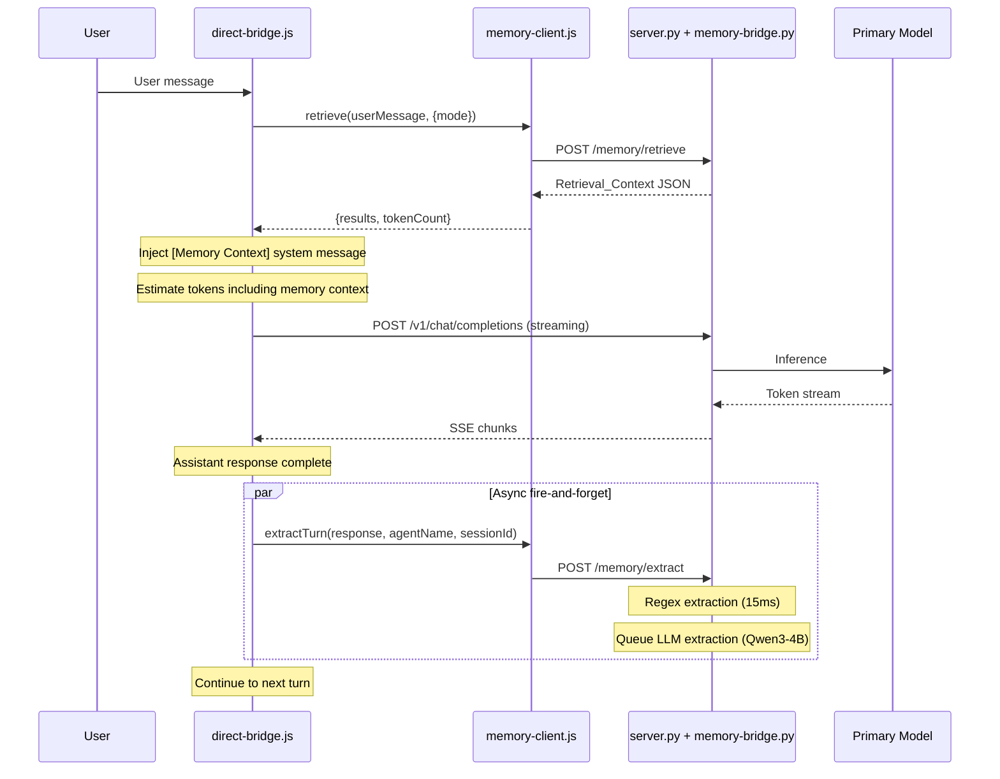
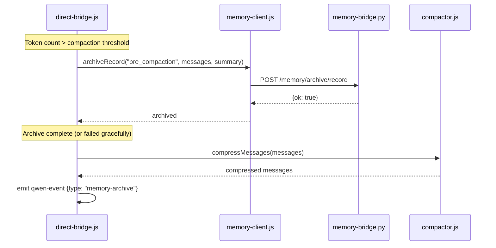

# Design Document: taosmd Memory Integration

## Overview

This design integrates taosmd as a persistent memory layer into QwenCoder Mac Studio. The architecture follows a **sidecar module pattern**: a new `memory-bridge.py` Python module is imported by the existing `server.py` FastAPI app, registering memory-related routes under the `/memory/` prefix. On the Node.js side, a new `memory-client.js` CommonJS module wraps all memory HTTP endpoints, and is consumed by `direct-bridge.js` (agent loop), `compactor.js` (archive-before-compact), and `orchestrator.js` (task memory augmentation).

The system uses **dual-model MLX serving** on Apple Silicon: the primary model (e.g. Qwen3-30B-A3B) handles inference while a secondary Qwen3-4B model runs async fact extraction. Both models share the Metal GPU but are serialized through separate asyncio semaphores to avoid concurrent Metal operations.

Key design decisions:
- **No new processes**: Memory endpoints live inside the existing FastAPI server, avoiding process management complexity
- **Fire-and-forget writes**: Archive and extraction calls are async/non-blocking from the agent loop's perspective
- **Graceful degradation**: Every memory integration point has a fallback path — if memory is unavailable, the system operates exactly as it does today
- **Token budget enforcement**: Retrieved memory context is capped at a configurable budget (default 2048 tokens) to prevent context window bloat

## Architecture

```mermaid
graph TB
    subgraph Electron Main Process
        DB[direct-bridge.js<br/>Agent Loop]
        ORC[orchestrator.js<br/>Task Dispatch]
        CMP[compactor.js<br/>Context Compression]
        MC[memory-client.js<br/>HTTP Client]
    end

    subgraph Python FastAPI Server :8090
        SRV[server.py<br/>Existing Routes]
        MB[memory-bridge.py<br/>Memory Routes]
        
        subgraph taosmd Core
            KG[KnowledgeGraph<br/>SQLite]
            VM[VectorMemory<br/>ONNX MiniLM]
            AR[Archive<br/>JSONL + FTS5]
            EX[MemoryExtractor<br/>Regex + LLM]
            SC[SessionCatalog]
            CS[CrystalStore]
            IC[IntentClassifier]
            RR[CrossEncoder<br/>Reranker]
        end
        
        subgraph MLX Models
            PM[Primary Model<br/>e.g. Qwen3-30B-A3B]
            EM[Extraction Model<br/>Qwen3-4B]
        end
    end

    subgraph Storage ~/.qwencoder/memory/
        KGDB[(knowledge-graph.db)]
        VMDB[(vector-memory.db)]
        ARDIR[(archive/*.jsonl)]
        ARIDX[(archive-index.db)]
        CRDB[(crystals.db)]
    end

    DB -->|retrieve, extract, archive| MC
    ORC -->|retrieve, archive| MC
    CMP -->|archive before compact| MC
    MC -->|HTTP /memory/*| MB
    MB --> KG
    MB --> VM
    MB --> AR
    MB --> EX
    MB --> SC
    MB --> CS
    MB --> IC
    MB --> RR
    EX --> EM
    SRV --> PM
    KG --> KGDB
    VM --> VMDB
    AR --> ARDIR
    AR --> ARIDX
    CS --> CRDB
```

### Data Flow: Agent Turn with Memory



### Data Flow: Archive-Before-Compact



## Components and Interfaces

### 1. memory-bridge.py (Python Backend Module)

A FastAPI router module imported by `server.py` via `app.include_router()`. Manages taosmd component lifecycle and exposes all `/memory/*` endpoints.

```python
# memory-bridge.py — imported by server.py

from fastapi import APIRouter, HTTPException
from pydantic import BaseModel

router = APIRouter(prefix="/memory", tags=["memory"])

# Module-level state
_kg = None          # KnowledgeGraph instance
_vm = None          # VectorMemory instance  
_archive = None     # Archive instance
_extractor = None   # MemoryExtractor instance
_extract_model = None  # Secondary MLX model for extraction
_extract_processor = None
_initialized = False

async def initialize(data_dir: str = "~/.qwencoder/memory/"):
    """Initialize all taosmd components. Called once at server startup."""
    ...

async def shutdown():
    """Flush pending writes and close connections. Called on SIGTERM."""
    ...
```

**Key endpoints:**

| Method | Path | Description |
|--------|------|-------------|
| `GET` | `/memory/status` | Component initialization state |
| `POST` | `/memory/kg/triples` | Add a knowledge graph triple |
| `GET` | `/memory/kg/query/{entity}` | Query triples by entity |
| `POST` | `/memory/kg/query-temporal` | Temporal point-in-time query |
| `DELETE` | `/memory/kg/clear` | Clear all triples (requires confirm) |
| `POST` | `/memory/archive/record` | Record an archive event |
| `GET` | `/memory/archive/search` | FTS5 full-text search |
| `GET` | `/memory/archive/events` | Recent events (paginated) |
| `POST` | `/memory/archive/compress` | Gzip old JSONL files |
| `POST` | `/memory/vector/add` | Add text to vector store |
| `POST` | `/memory/vector/search` | Hybrid semantic search |
| `POST` | `/memory/retrieve` | Unified retrieval (all layers) |
| `POST` | `/memory/extract` | Trigger fact extraction |
| `GET` | `/memory/extract/queue` | Extraction queue status |
| `POST` | `/memory/extractor/load` | Load Qwen3-4B extraction model |
| `POST` | `/memory/extractor/unload` | Unload extraction model |
| `POST` | `/memory/session/enrich` | Session catalog enrichment |
| `POST` | `/memory/session/crystallize` | Generate crystal digest |
| `GET` | `/memory/stats` | Storage sizes and record counts |

### 2. memory-client.js (Node.js Client Module)

CommonJS module using Node.js built-in `http` module. All functions return promises and never throw — errors are caught internally and return safe defaults.

```javascript
// memory-client.js
'use strict'

const http = require('http')

const BASE_URL = process.env.MLX_SERVER_URL || 'http://localhost:8090'

// Timeout presets (ms)
const TIMEOUTS = {
  retrieve: 5000,
  archive: 2000,
  extract: 30000,
  status: 3000,
  default: 5000,
}

/**
 * @param {string} query
 * @param {{ mode?: 'fast'|'thorough', agentName?: string, topK?: number }} options
 * @returns {Promise<{ results: Array<{source, content, score, metadata}>, tokenCount: number }>}
 */
async function retrieve(query, options = {}) { ... }

/**
 * @param {'conversation'|'tool_call'|'decision'|'error'|'pre_compaction'|'session_start'|'session_end'|'task_completion'|'workflow_start'} eventType
 * @param {string|object} payload
 * @param {string} summary
 * @returns {Promise<{ok: boolean}>}
 */
async function archiveRecord(eventType, payload, summary) { ... }

/**
 * Fire-and-forget extraction. Returns immediately.
 * @param {string} message
 * @param {string} agentName
 * @param {string} sessionId
 */
async function extractTurn(message, agentName, sessionId) { ... }

async function kgAddTriple(subject, predicate, object, validFrom, validUntil) { ... }
async function kgQueryEntity(entity) { ... }
async function vectorSearch(query, options = {}) { ... }
async function archiveSearch(query, options = {}) { ... }
async function getStatus() { ... }

module.exports = {
  retrieve, archiveRecord, extractTurn,
  kgAddTriple, kgQueryEntity, vectorSearch, archiveSearch, getStatus,
}
```

### 3. Integration Points

#### direct-bridge.js Modifications

The `_agentLoop()` method gains three integration points:

1. **Pre-LLM retrieval** (before each `_streamCompletion` call):
   - Call `memoryClient.retrieve(userMessage)` with mode based on recall phrase detection
   - Inject results as a `[Memory Context]` system message
   - Include memory tokens in `estimateMessagesTokens()` calculation

2. **Post-turn extraction** (after assistant response):
   - Fire-and-forget `memoryClient.extractTurn(response, agentName, sessionId)`

3. **Tool call archiving** (after each tool execution):
   - Fire-and-forget `memoryClient.archiveRecord('tool_call', ...)`

4. **Archive-before-compact** (when compaction triggers):
   - Archive messages before calling `compactor.compressMessages()`
   - Emit `qwen-event` with type `memory-archive`

#### orchestrator.js Modifications

The `_dispatchNode()` method gains two integration points:

1. **Pre-dispatch retrieval**: Query memory for task-relevant context, append to `specContext`
2. **Post-completion archiving**: Archive task results with `event_type: "task_completion"`
3. **Workflow start archiving**: Archive task graph on `start()`

### 4. Secret Filtering Pipeline

All content passes through taosmd's 17-pattern regex filter before entering any memory layer. The filter runs in `memory-bridge.py` as a preprocessing step on every ingest endpoint.

```python
# Patterns include: API keys, bearer tokens, passwords, private keys,
# AWS credentials, connection strings, etc.
# Matched values are replaced with [REDACTED]
# Redaction events are logged (pattern type + char count, never the value)
```

### 5. Dual-Model MLX Serving

The extraction model (Qwen3-4B) is loaded via `mlx_lm.load()` into a separate variable from the primary model. Both models share the Metal GPU but inference is serialized:

- Primary model uses the existing `_inference_semaphore` (concurrency=1)
- Extraction model uses a separate `_extraction_semaphore` (concurrency=1)
- Both semaphores can be held simultaneously since MLX operations on different models don't conflict at the Python level — Metal serializes GPU work internally
- Memory check before loading: reject if active Metal memory > 85% of system RAM


## Data Models

### Python-side Pydantic Models (memory-bridge.py)

```python
from pydantic import BaseModel
from typing import Optional, Any
from datetime import datetime

# ── Knowledge Graph ──

class TripleRequest(BaseModel):
    subject: str
    predicate: str
    object: str
    valid_from: Optional[datetime] = None
    valid_until: Optional[datetime] = None

class TripleResponse(BaseModel):
    id: int
    subject: str
    predicate: str
    object: str
    valid_from: Optional[datetime]
    valid_until: Optional[datetime]
    created_at: datetime

class TemporalQueryRequest(BaseModel):
    entity: str
    at_time: datetime

# ── Archive ──

class ArchiveRecordRequest(BaseModel):
    event_type: str  # conversation, tool_call, decision, error, pre_compaction, session_start, session_end, task_completion, workflow_start
    payload: Any     # verbatim content (string or dict)
    summary: str     # short description (first 200 chars)
    agent_name: Optional[str] = None
    session_id: Optional[str] = None
    turn_number: Optional[int] = None

class ArchiveEvent(BaseModel):
    id: int
    event_type: str
    payload: Any
    summary: str
    agent_name: Optional[str]
    session_id: Optional[str]
    timestamp: datetime

# ── Vector Memory ──

class VectorAddRequest(BaseModel):
    text: str
    metadata: Optional[dict] = None

class VectorSearchRequest(BaseModel):
    query: str
    top_k: int = 10
    hybrid: bool = True

# ── Unified Retrieval ──

class RetrieveRequest(BaseModel):
    query: str
    agent_name: Optional[str] = None
    top_k: int = 10
    mode: str = "fast"  # "fast" or "thorough"

class RetrievalResult(BaseModel):
    source: str      # "kg", "vector", "archive"
    content: str
    score: float
    metadata: Optional[dict] = None

class RetrieveResponse(BaseModel):
    results: list[RetrievalResult]
    token_count: int
    query_expanded: Optional[str] = None

# ── Extraction ──

class ExtractRequest(BaseModel):
    message: str
    agent_name: str
    session_id: str

class ExtractorLoadRequest(BaseModel):
    model_path: str

# ── Session ──

class SessionEnrichRequest(BaseModel):
    session_id: str

class SessionCrystallizeRequest(BaseModel):
    session_id: str

# ── Status ──

class MemoryStatus(BaseModel):
    knowledge_graph: str   # "ready", "unavailable", "error"
    vector_memory: str
    archive: str
    extraction_model: Optional[str]  # model name or None
    extraction_model_memory_gb: Optional[float]

class MemoryStats(BaseModel):
    kg_triples: int
    kg_db_size_bytes: int
    vector_count: int
    vector_db_size_bytes: int
    archive_events: int
    archive_size_bytes: int
    crystals_count: int
    last_extraction_at: Optional[datetime]
```

### Node.js Data Shapes (memory-client.js)

```javascript
// Return type from retrieve()
// { results: [{source, content, score, metadata}], tokenCount: number }

// Return type from getStatus()
// { knowledgeGraph: 'ready'|'unavailable', vectorMemory: 'ready'|'unavailable',
//   archive: 'ready'|'unavailable', extractionModel: string|null }

// archiveRecord() payload shape
// { eventType: string, payload: string|object, summary: string,
//   agentName?: string, sessionId?: string, turnNumber?: number }
```

### Storage Layout

```
~/.qwencoder/memory/
├── knowledge-graph.db      # SQLite — temporal triples
├── vector-memory.db        # SQLite — ONNX MiniLM embeddings
├── archive/                # Append-only JSONL files
│   ├── 2025-01-15.jsonl
│   ├── 2025-01-15.jsonl.gz  # Compressed after 24h
│   └── ...
├── archive-index.db        # SQLite FTS5 index
└── crystals.db             # SQLite — session digests
```


## Correctness Properties

*A property is a characteristic or behavior that should hold true across all valid executions of a system — essentially, a formal statement about what the system should do. Properties serve as the bridge between human-readable specifications and machine-verifiable correctness guarantees.*

### Property 1: Triple storage and query round-trip

*For any* valid triple (subject, predicate, object), after adding it to the Knowledge Graph via `kgAddTriple()`, querying by either the subject or object entity via `kgQueryEntity()` SHALL return a result set that contains the original triple with matching subject, predicate, and object values.

**Validates: Requirements 2.1, 2.2**

### Property 2: Temporal contradiction supersession

*For any* two triples sharing the same subject and predicate but different objects, after adding both sequentially, the Knowledge Graph SHALL mark the first triple's `valid_until` to a non-null timestamp and the second triple's `valid_from` to a non-null timestamp, such that querying at the current time returns only the newer triple.

**Validates: Requirements 2.3**

### Property 3: Temporal query returns only valid triples

*For any* set of triples with defined `valid_from` and `valid_until` windows, and *for any* query timestamp `t`, the temporal query endpoint SHALL return exactly those triples where `valid_from <= t` and (`valid_until` is null or `valid_until >= t`), and no others.

**Validates: Requirements 2.4**

### Property 4: Archive record metadata completeness

*For any* archive record written with an `event_type`, `payload`, `summary`, `agent_name`, and `session_id`, retrieving that record SHALL include a UTC `timestamp`, the provided `agent_name`, and the provided `session_id` in its metadata.

**Validates: Requirements 3.1, 3.5**

### Property 5: Archive FTS search finds stored content

*For any* archived record whose payload contains a distinctive word (length >= 4, alphanumeric), searching the archive with that word as the query SHALL return a result set that includes the original record.

**Validates: Requirements 3.2**

### Property 6: Archive events ordered by timestamp descending

*For any* sequence of N archived events (N >= 2), the `/memory/archive/events` endpoint with `limit >= N` SHALL return events where each event's timestamp is greater than or equal to the next event's timestamp (descending order).

**Validates: Requirements 3.6**

### Property 7: Vector search round-trip with hybrid boosting

*For any* text string added to Vector Memory, searching with a query derived from that text (substring or exact match) with `hybrid: true` SHALL return a result set that includes the original text, and the result's score with `hybrid: true` SHALL be greater than or equal to the score with `hybrid: false` when the query contains exact keyword matches.

**Validates: Requirements 4.1, 4.2, 4.3**

### Property 8: Unified retrieval token budget enforcement

*For any* retrieval query and *for any* configured token budget B, the `POST /memory/retrieve` response's `token_count` SHALL be less than or equal to B.

**Validates: Requirements 5.5, 5.6**

### Property 9: Unified retrieval thorough mode spans all sources

*For any* retrieval query in "thorough" mode where all three memory layers (KG, vector, archive) contain matching content, the response SHALL include at least one result with `source: "kg"`, at least one with `source: "vector"`, and at least one with `source: "archive"`.

**Validates: Requirements 5.2**

### Property 10: Extraction pipeline stores in KG and vector

*For any* message containing at least one extractable entity-relationship pattern (e.g. "X uses Y", "X is a Y"), after calling the extract endpoint, the Knowledge Graph SHALL contain at least one new triple, and Vector Memory SHALL contain the message content as a searchable entry.

**Validates: Requirements 7.4, 7.5**

### Property 11: Memory client error resilience

*For any* memory-client function (retrieve, archiveRecord, extractTurn, kgAddTriple, kgQueryEntity, vectorSearch, archiveSearch, getStatus) called when the server is unreachable, the function SHALL return a safe default value (empty array, null, or {ok: false}) without throwing an exception.

**Validates: Requirements 11.3**

### Property 12: Recall phrase detection selects thorough mode

*For any* user message containing one of the recall phrases ("remember when", "what did I say about", "last time", "previously"), the mode passed to `retrieve()` SHALL be "thorough". *For any* user message not containing any recall phrase, the mode SHALL be "fast".

**Validates: Requirements 8.4**

### Property 13: Memory context injection format

*For any* non-empty retrieval result, the injected system message SHALL start with the prefix `[Memory Context]` and SHALL be positioned immediately before the user's message in the messages array.

**Validates: Requirements 8.2**

### Property 14: Token estimation includes memory context

*For any* messages array with an injected memory context system message, `estimateMessagesTokens(messages)` SHALL return a value greater than `estimateMessagesTokens(messagesWithoutMemory)` by at least the token estimate of the memory context content.

**Validates: Requirements 8.6**

### Property 15: Orchestrator specContext augmentation

*For any* task dispatched by the Orchestrator when retrieval returns non-empty results, the task's `specContext` field SHALL contain the retrieval context appended after any pre-existing spec context.

**Validates: Requirements 10.2**

### Property 16: Secret filtering on ingest

*For any* text containing a pattern matching an API key (e.g. `sk-...`, `AKIA...`), bearer token, or AWS credential, after ingestion into any memory layer (KG triple object, vector text, archive payload), the stored content SHALL contain `[REDACTED]` in place of the matched pattern and SHALL NOT contain the original secret value.

**Validates: Requirements 15.1, 15.2, 15.4**

### Property 17: KG clear requires confirmation

*For any* DELETE request to `/memory/kg/clear` without `confirm: true` in the body, the Knowledge Graph SHALL NOT be cleared and the endpoint SHALL return an error response. Only requests with `confirm: true` SHALL clear the data.

**Validates: Requirements 14.1**

### Property 18: Tool call archive truncation

*For any* tool call result exceeding 10000 characters, the archived payload SHALL contain exactly the first 10000 characters of the result, and the metadata SHALL include `truncated: true`. *For any* tool call result of 10000 characters or fewer, the full result SHALL be archived and `truncated` SHALL be absent or false.

**Validates: Requirements 12.5**

### Property 19: Tool call archive metadata completeness

*For any* archived tool call, the metadata SHALL include the tool name (string), a summary of arguments (first 200 characters), the result status ("success" or "error"), and the result size in bytes (number).

**Validates: Requirements 12.2**


## Error Handling

### Graceful Degradation Strategy

Every memory integration point follows the same pattern: **try memory, catch and continue without it**. The system must operate identically to its current behavior when memory is unavailable.

| Component | Failure Mode | Behavior |
|-----------|-------------|----------|
| `memory-bridge.py` | taosmd not installed | Log error, return HTTP 503 for all `/memory/*` endpoints, server continues serving inference |
| `memory-bridge.py` | SQLite DB locked/corrupt | Return HTTP 503 for affected layer, other layers continue |
| `memory-bridge.py` | ONNX model missing | Vector search returns 503, KG and Archive continue |
| `memory-bridge.py` | Extraction model OOM | Reject load with HTTP 507, fall back to regex extraction |
| `memory-bridge.py` | Metal memory > 85% | Reject extraction model load, primary model unaffected |
| `memory-client.js` | Server unreachable | Return safe defaults (empty arrays, null), log error, never throw |
| `memory-client.js` | HTTP 5xx response | Same as unreachable — return safe defaults |
| `memory-client.js` | Request timeout | Same as unreachable — return safe defaults |
| `direct-bridge.js` | Retrieval fails | Skip memory context injection, proceed with normal agent loop |
| `direct-bridge.js` | Extraction fails | Log and continue — extraction is fire-and-forget |
| `direct-bridge.js` | Archive fails before compact | Log and proceed with compaction |
| `orchestrator.js` | Retrieval fails | Dispatch task without memory augmentation |
| `orchestrator.js` | Archive fails | Log and continue task execution |

### Error Categories

1. **Initialization errors** (startup): Logged, memory features disabled, server continues
2. **Runtime errors** (per-request): Caught per-endpoint, return appropriate HTTP status, don't crash server
3. **Client-side errors** (Node.js): Caught in memory-client.js, return safe defaults, never propagate to caller
4. **Resource errors** (Metal OOM, disk full): Return 507/503, suggest corrective action in error message

### Secret Filtering Errors

If the secret filtering pipeline itself fails (regex compilation error, etc.), the system SHALL reject the ingest operation rather than storing unfiltered content. This is the one case where we fail closed rather than fail open.

### Timeout Configuration

```javascript
// memory-client.js timeouts
const TIMEOUTS = {
  retrieve: 5000,    // 5s — retrieval is on the critical path
  archive: 2000,     // 2s — archive writes are fire-and-forget
  extract: 30000,    // 30s — LLM extraction can be slow
  status: 3000,      // 3s — health checks
  default: 5000,     // 5s — fallback
}
```

## Testing Strategy

### Dual Testing Approach

This feature uses both unit tests and property-based tests for comprehensive coverage:

- **Property-based tests** (`test/memory-client.property.test.js`, `test/memory-bridge.property.test.js`): Verify universal properties across generated inputs using `fast-check` v4. Each property test runs minimum 100 iterations (configured at `{ numRuns: 150 }` to match project convention).
- **Unit tests** (`test/memory-client.test.js`, `test/memory-bridge.test.js`): Verify specific examples, edge cases, integration points, and error conditions.

### Property-Based Testing Configuration

- Library: `fast-check` v4 (already a devDependency)
- Test runner: Node.js built-in `node:test`
- Assertions: `node:assert/strict`
- Iterations: `{ numRuns: 150 }` per property
- Each property test is tagged with a comment referencing the design property:
  ```javascript
  // Feature: taosmd-memory-integration, Property 1: Triple storage and query round-trip
  ```

### Test File Organization

| File | Scope |
|------|-------|
| `test/memory-client.test.js` | Unit tests for memory-client.js — mocked HTTP, error handling, timeout behavior |
| `test/memory-client.property.test.js` | Property tests for client-side logic — error resilience (P11), recall phrase detection (P12), context injection format (P13), token estimation (P14), truncation (P18), metadata completeness (P19) |
| `test/memory-bridge.test.js` | Unit tests for memory-bridge.py endpoints — requires Python subprocess or HTTP mocking |
| `test/memory-bridge.property.test.js` | Property tests for server-side logic — triple round-trip (P1), temporal queries (P2, P3), archive metadata (P4), FTS search (P5), event ordering (P6), vector search (P7), token budget (P8), retrieval sources (P9), extraction (P10), secret filtering (P16), KG clear guard (P17) |
| `test/direct-bridge-memory.test.js` | Integration tests for agent loop memory augmentation — mode selection, archive-before-compact flow |
| `test/orchestrator-memory.test.js` | Integration tests for orchestrator memory integration — specContext augmentation, task archiving |

### Mocking Strategy

Since the memory system depends on taosmd (Python) and HTTP endpoints, tests use:

1. **memory-client.js tests**: Mock the `http.request` function to simulate server responses and failures
2. **Pure logic tests**: Test recall phrase detection, token estimation, truncation, and metadata formatting as pure functions extracted from the integration points
3. **Integration tests**: Use a lightweight HTTP mock server or stub the memory-client module to verify the agent loop and orchestrator call the right functions at the right times

### What Is NOT Property-Tested

- Server startup/shutdown lifecycle (smoke tests)
- MLX model loading and Metal memory management (integration tests)
- ONNX embedding latency (performance benchmarks)
- Concurrent dual-model inference (integration tests)
- SIGTERM signal handling (integration tests)
- UI event emission (example-based tests)

