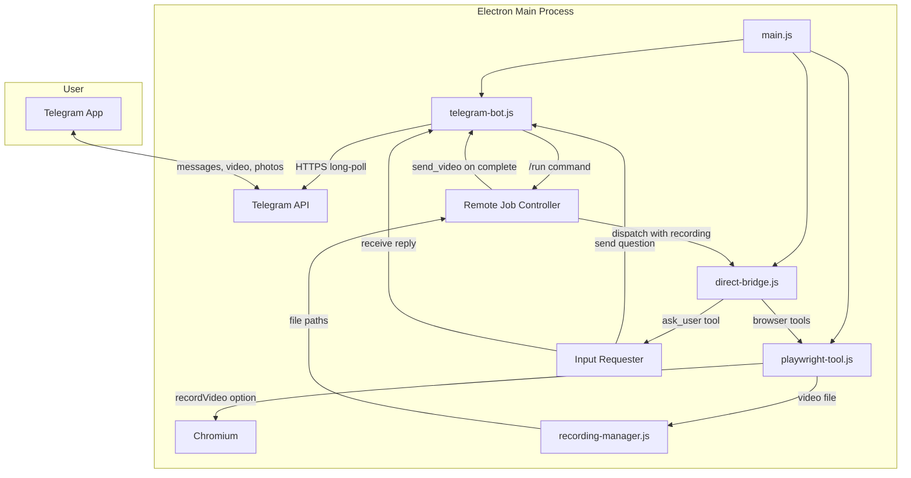

# Design Document: Telegram Video Recording

## Overview

This design adds video recording to the existing Playwright browser automation and introduces a Telegram bot module for remote agent control. The feature touches two existing modules and introduces two new ones:

- **New**: `telegram-bot.js` — Telegram Bot API client with long-polling, send_message/send_video/send_photo, QR pairing, and config persistence
- **New**: `recording-manager.js` — Recording file lifecycle: naming, listing, validation, cleanup
- **Modified**: `playwright-tool.js` — `createPlaywrightInstance()` gains an optional `recordingOptions` parameter that configures Playwright's `recordVideo` context option
- **Modified**: `direct-bridge.js` — New `ask_user` tool definition, Telegram screenshot forwarding hook, remote job dispatch with recording enabled

The design follows existing codebase conventions: CommonJS modules, `'use strict'`, EventEmitter patterns, `node:https` for HTTP (no axios/node-fetch), and no TypeScript.

### Key Design Decisions

1. **node:https for Telegram API** — The Rust reference uses `reqwest`; we use Node's built-in `https` module with `multipart/form-data` hand-rolled for file uploads. This avoids adding dependencies.
2. **Long-polling over webhooks** — The bot runs inside a desktop Electron app behind NAT, so webhooks aren't viable. Long-polling with exponential backoff matches the Rust implementation.
3. **Recording via Playwright's `recordVideo` context option** — Playwright natively records video per browser context. We pass `recordVideo: { dir, size }` to `browser.newContext()` and retrieve the path via `page.video().path()` after close.
4. **QR pairing via Telegram deep links** — `https://t.me/{botUsername}?start={token}` is encoded as a QR code. When the user opens it, Telegram sends `/start {token}` to the bot, completing the pairing.
5. **Input requests via Promise resolution** — The `ask_user` tool returns a Promise that resolves when the user replies in Telegram or times out after 5 minutes. The agent loop naturally waits on this like any other tool call.

## Architecture



### Data Flow: Remote Job Lifecycle

1. **Pairing**: User clicks "Pair Telegram" in the app → `telegram-bot.js` generates a 32-char hex token, encodes `https://t.me/{botUsername}?start={token}` as a QR PNG data URL → user scans with phone → Telegram sends `/start {token}` → bot validates token, stores `chatId`, persists config.

2. **Job trigger**: User sends `/run <prompt>` in Telegram → bot emits `'command'` event → Remote Job Controller creates a job, calls `recording-manager.js` to get a recording path, creates a `DirectBridge` instance with recording enabled, starts `_agentLoop`.

3. **Recording**: `createPlaywrightInstance({ recordingOptions: { dir, size } })` passes `recordVideo` to Playwright's `newContext()`. Every page in that context is recorded.

4. **Screenshots**: When the agent calls `browser_screenshot` during a Telegram job, the screenshot buffer is also sent to the paired chat via `send_photo`.

5. **Input requests**: When the agent calls `ask_user`, the tool executor sends the question to Telegram, creates a pending Promise, and returns it. The agent loop awaits the Promise. When the user replies (or 5 min timeout), the Promise resolves with the reply text.

6. **Completion**: Job finishes → `page.close()` finalizes the video → `recording-manager.js` verifies the file → `send_video` sends it to Telegram with a result caption.

## Components and Interfaces

### playwright-tool.js modifications

```javascript
// createPlaywrightInstance gains an optional options parameter
function createPlaywrightInstance(options = {}) {
  const { recordingOptions } = options
  // recordingOptions: { dir: string, size?: { width, height }, format?: 'mp4'|'webm' }

  let _browser = null
  let _context = null
  let _page = null
  let _recordingPath = null

  async function ensureBrowser() {
    if (_page && !_page.isClosed()) return _page
    const { chromium } = require('playwright')
    _browser = await chromium.launch({ headless: true })

    const contextOptions = {
      viewport: { width: 1280, height: 720 },
      userAgent: '...',
    }

    if (recordingOptions) {
      // Create recording directory if it doesn't exist
      const fs = require('node:fs')
      if (!fs.existsSync(recordingOptions.dir)) {
        fs.mkdirSync(recordingOptions.dir, { recursive: true })
      }
      contextOptions.recordVideo = {
        dir: recordingOptions.dir,
        size: recordingOptions.size || { width: 1280, height: 720 },
      }
    }

    try {
      _context = await _browser.newContext(contextOptions)
    } catch (err) {
      // Fallback: if recording fails, create context without recording
      if (recordingOptions) {
        delete contextOptions.recordVideo
        _context = await _browser.newContext(contextOptions)
        _recordingPath = null
      } else {
        throw err
      }
    }

    _page = await _context.newPage()
    _page.setDefaultTimeout(30000)
    return _page
  }

  // New method: get the recording file path (null if not recording or not yet saved)
  function getRecordingPath() {
    return _recordingPath
  }

  async function closeBrowser() {
    if (_page && !_page.isClosed()) {
      try {
        const video = _page.video()
        if (video) {
          _recordingPath = await video.path()
        }
      } catch { /* no video */ }
    }
    if (_browser) {
      await _browser.close().catch(() => {})
      _browser = null; _context = null; _page = null
    }
  }

  // ... existing tool implementations unchanged ...

  return { execute, closeBrowser, getRecordingPath }
}
```

### telegram-bot.js (new module)

```javascript
'use strict'
const https = require('node:https')
const fs = require('node:fs')
const path = require('node:path')
const crypto = require('node:crypto')
const { EventEmitter } = require('node:events')

const TELEGRAM_API_BASE = 'https://api.telegram.org/bot'
const BACKOFF_BASE_DELAY = 2    // seconds
const BACKOFF_MAX_DELAY = 60    // seconds
const PAIRING_TOKEN_EXPIRY = 10 * 60 * 1000 // 10 minutes in ms

class TelegramBot extends EventEmitter {
  constructor(options = {}) // options: { configPath, appDataDir }

  // ── Lifecycle ──
  async start(token)          // Validate token via getMe, begin long-polling
  async stop()                // Cease polling, release resources within 5s
  getStatus()                 // → { connected, bot_username, polling, last_error }

  // ── Messaging ──
  async sendMessage(chatId, text)                    // → { ok } or { error }
  async sendVideo(chatId, filePath, caption)         // → { ok } or { error }
  async sendPhoto(chatId, filePath, caption)         // → { ok } or { error }

  // ── Pairing ──
  generatePairingToken()      // → { token, qrDataUrl, expiresAt }
  validatePairingToken(token, chatId) // → { ok } or { error, reason }
  getPairedChatId()           // → number | null

  // ── Config persistence ──
  saveConfig()                // Write { token, pairedChatId, botUsername } to disk
  loadConfig()                // Read config from disk, return parsed object or null

  // ── Events emitted ──
  // 'message'  → { chatId, text, messageId }
  // 'command'  → { chatId, command, args, messageId }
  // 'photo'    → { chatId, fileId, caption, messageId }
  // 'error'    → { message }
}
```

**Key internal methods**:

```javascript
// Long-polling loop
async _pollLoop() {
  let offset = 0
  let retryCount = 0
  while (this._polling) {
    try {
      const updates = await this._getUpdates(offset)
      retryCount = 0 // reset on success
      for (const update of updates) {
        offset = update.update_id + 1
        this._handleUpdate(update)
      }
    } catch (err) {
      retryCount = Math.min(retryCount + 1, 10)
      const delay = calculateBackoffDelay(retryCount)
      this._lastError = err.message
      this.emit('error', { message: err.message })
      await sleep(delay * 1000)
    }
  }
}

// Backoff calculation (pure function, exported for testing)
function calculateBackoffDelay(retryCount) {
  return Math.min(BACKOFF_BASE_DELAY * Math.pow(2, retryCount), BACKOFF_MAX_DELAY)
}
```

**Telegram API calls use `node:https`**:

```javascript
// HTTPS request helper (no external deps)
function telegramRequest(method, token, params) {
  return new Promise((resolve, reject) => {
    const url = new URL(`${TELEGRAM_API_BASE}${token}/${method}`)
    const body = JSON.stringify(params)
    const req = https.request(url, {
      method: 'POST',
      headers: { 'Content-Type': 'application/json', 'Content-Length': Buffer.byteLength(body) },
      timeout: 35000,
    }, (res) => {
      let data = ''
      res.on('data', chunk => data += chunk)
      res.on('end', () => {
        try { resolve(JSON.parse(data)) }
        catch { reject(new Error(data || 'Empty response')) }
      })
    })
    req.on('timeout', () => { req.destroy(); reject(new Error('Request timed out')) })
    req.on('error', reject)
    req.write(body)
    req.end()
  })
}

// File upload uses multipart/form-data (hand-rolled, no deps)
function telegramUpload(method, token, chatId, fieldName, filePath, caption) {
  // Build multipart body with boundary, file part, caption part
  // Uses https.request with Content-Type: multipart/form-data
}
```

### recording-manager.js (new module)

```javascript
'use strict'
const fs = require('node:fs')
const path = require('node:path')

class RecordingManager {
  constructor(options = {}) // options: { baseDir }
  // baseDir defaults to {app_data}/telegram-recordings/

  // Generate a unique recording filename
  generateFilename(jobId, format = 'webm')
  // → 'recording_1719000000000_job123.webm'

  // Get the full path for a new recording
  getRecordingDir(jobId)
  // → '{baseDir}/{jobId}/'

  // List all recordings
  listRecordings()
  // → [{ filePath, filename, sizeBytes, createdAt }]

  // Validate a recording file exists and is readable
  validateRecording(filePath)
  // → { ok: true, sizeBytes } or { ok: false, error }

  // Check if file exceeds Telegram's 50MB limit
  checkSizeLimit(filePath)
  // → { withinLimit: true/false, sizeBytes }
}
```

### direct-bridge.js modifications

**New `ask_user` tool definition** added to `TOOL_DEFS`:

```javascript
{
  type: 'function',
  function: {
    name: 'ask_user',
    description: 'Ask the user a question and wait for their reply. Use when you need clarification or input.',
    parameters: {
      type: 'object',
      properties: {
        question: { type: 'string', description: 'The question to ask the user' },
      },
      required: ['question'],
    },
  },
}
```

**In `executeTool`** — new `ask_user` case:

```javascript
case 'ask_user': {
  if (!inputRequester) return { result: '(No input channel available — proceeding without user input)' }
  try {
    const reply = await inputRequester.ask(args.question)
    return { result: reply }
  } catch (err) {
    return { result: `(User input timed out: ${err.message})` }
  }
}
```

**Input Requester** (embedded in `direct-bridge.js` or passed as option):

```javascript
class InputRequester {
  constructor(telegramBot, chatId) // bot instance + paired chat ID

  async ask(question) {
    // 1. Send question to Telegram
    await this._bot.sendMessage(this._chatId, `🤖 Agent asks:\n${question}`)
    // 2. Wait for reply (Promise that resolves on next message or 5min timeout)
    return new Promise((resolve, reject) => {
      const timeout = setTimeout(() => {
        this._bot.removeListener('message', handler)
        resolve('(No response received within 5 minutes)')
      }, 5 * 60 * 1000)

      const handler = ({ chatId, text }) => {
        if (chatId === this._chatId) {
          clearTimeout(timeout)
          this._bot.removeListener('message', handler)
          resolve(text)
        }
      }
      this._bot.on('message', handler)
    })
  }

  hasPendingRequest() // → boolean
}
```

**Remote Job Controller** (in `direct-bridge.js` or separate coordination logic):

```javascript
class RemoteJobController {
  constructor({ telegramBot, chatId, recordingManager })

  async runJob(prompt) {
    // 1. Generate recording path via recordingManager
    // 2. Create DirectBridge with recording-enabled playwright instance
    // 3. Wire up InputRequester for ask_user
    // 4. Send confirmation message with job ID
    // 5. Start _agentLoop, send periodic status updates (>= 30s apart)
    // 6. On complete: close browser, send video via send_video
    // 7. On error: send error message
  }

  async handleCommand(command, args) {
    // /run, /status, /stop, /screenshot dispatch
  }

  getJobState() // → 'idle' | 'running' | 'completed' | 'failed'
}
```

### Screenshot forwarding hook

In the `_agentLoop` tool execution section of `DirectBridge`, after executing `browser_screenshot` during a Telegram-initiated job:

```javascript
// After browser_screenshot execution, if this is a Telegram job
if (fnName === 'browser_screenshot' && this._telegramForwarder) {
  // Extract the base64 PNG from the result, save to temp file, send via Telegram
  const b64Match = result.result?.match(/data:image\/png;base64,([A-Za-z0-9+/=]+)/)
  if (b64Match) {
    const tmpPath = path.join(os.tmpdir(), `screenshot_${Date.now()}.png`)
    fs.writeFileSync(tmpPath, Buffer.from(b64Match[1], 'base64'))
    await this._telegramForwarder.sendPhoto(tmpPath, 'Browser screenshot')
  }
}
```

## Data Models

### Bot Configuration (persisted to disk)

```javascript
// {app_data}/telegram-bot-config.json
{
  "token": "123456:ABC-DEF...",      // Telegram bot token
  "pairedChatId": "987654321",        // Paired Telegram chat ID (string for JSON safety)
  "botUsername": "my_agent_bot"        // Bot username from getMe
}
```

### Pairing Token (in-memory)

```javascript
{
  token: 'a1b2c3d4...',              // 32+ hex chars
  createdAt: 1719000000000,           // Date.now() when generated
  consumed: false,                    // true after first use
}
```

### Recording Metadata

```javascript
{
  filePath: '/path/to/recording_1719000000000_job123.webm',
  filename: 'recording_1719000000000_job123.webm',
  sizeBytes: 15234567,
  createdAt: '2024-06-21T12:00:00.000Z',
}
```

### Remote Job State

```javascript
{
  jobId: 'job_1719000000000',
  state: 'running',                   // 'idle' | 'running' | 'completed' | 'failed'
  prompt: 'Navigate to example.com and take a screenshot',
  chatId: 987654321,
  recordingPath: '/path/to/recording.webm',
  startedAt: 1719000000000,
  lastStatusUpdate: 1719000030000,    // For 30s throttling
  error: null,
}
```

### Telegram Update (parsed from API)

```javascript
{
  update_id: 123456789,
  message: {
    message_id: 42,
    chat: { id: 987654321 },
    text: '/run Navigate to example.com',
    // Optional: photo, video, document arrays
  }
}
```

## Correctness Properties

*A property is a characteristic or behavior that should hold true across all valid executions of a system — essentially, a formal statement about what the system should do. Properties serve as the bridge between human-readable specifications and machine-verifiable correctness guarantees.*

### Property 1: Recording filename matches pattern

*For any* job ID string and format string ("mp4" or "webm"), the generated filename SHALL match the pattern `recording_{timestamp}_{jobId}.{format}` where timestamp is a numeric value and the filename contains the exact jobId and format provided.

**Validates: Requirements 2.2**

### Property 2: Telegram message parsing extracts correct fields

*For any* valid Telegram update object containing a text message, parsing the update SHALL emit an event containing the exact `chat.id`, `text`, and `message_id` values from the original update.

**Validates: Requirements 3.3**

### Property 3: Exponential backoff delay follows formula

*For any* non-negative retry count, the calculated backoff delay SHALL equal `min(2 * 2^retryCount, 60)` seconds — starting at 2s for retry 0, doubling each retry, capping at 60s.

**Validates: Requirements 3.7**

### Property 4: Bot status object has required fields

*For any* bot state (started, stopped, polling, errored), `getStatus()` SHALL return an object with exactly the fields `connected` (boolean), `bot_username` (string or null), `polling` (boolean), and `last_error` (string or null).

**Validates: Requirements 3.9**

### Property 5: Pairing token generation produces valid tokens

*For any* invocation of `generatePairingToken()`, the returned token SHALL be a string of at least 32 hexadecimal characters, and no two invocations SHALL produce the same token.

**Validates: Requirements 4.1**

### Property 6: Pairing tokens are single-use

*For any* valid pairing token, the first call to `validatePairingToken(token, chatId)` SHALL succeed, and any subsequent call with the same token SHALL be rejected with an error.

**Validates: Requirements 4.5**

### Property 7: Pairing tokens expire after 10 minutes

*For any* pairing token and any elapsed time, if the elapsed time exceeds 10 minutes then `validatePairingToken` SHALL reject the token as expired, and if the elapsed time is within 10 minutes the token SHALL be accepted (if not already consumed).

**Validates: Requirements 4.6**

### Property 8: /run command parsing extracts prompt text

*For any* string `prompt`, parsing the message `/run {prompt}` SHALL create a job whose prompt field equals the exact `prompt` string provided.

**Validates: Requirements 5.1**

### Property 9: /status reply includes current job state

*For any* job state value (idle, running, completed, failed), the response to a `/status` command SHALL contain the state string, and SHALL contain the job ID when the state is not "idle".

**Validates: Requirements 5.7**

### Property 10: Input request round-trip preserves reply text

*For any* question string and reply string, when `ask_user` sends the question and the user replies with the reply string, the tool call result delivered to the agent SHALL equal the exact reply string.

**Validates: Requirements 6.3**

### Property 11: Configuration serialization round-trip

*For any* valid configuration object with `token` (non-empty string), `pairedChatId` (string of digits or null), and `botUsername` (string or null), serializing to JSON and deserializing back SHALL produce an object deeply equal to the original.

**Validates: Requirements 8.4, 8.5**

## Error Handling

| Scenario | Handling |
|---|---|
| Playwright fails to start recording | Fall back to non-recording context, log warning, continue job |
| Telegram API returns error during polling | Exponential backoff (2s → 60s cap), emit `'error'` event, resume polling |
| Telegram API returns error on send_message/send_video | Return `{ error }` to caller, do not retry (caller decides) |
| Bot token invalid (getMe fails) | Reject `start()` with error, do not begin polling |
| Pairing token expired or reused | Send error message to Telegram chat, reject pairing |
| Recording file missing at send time | Send error message to Telegram chat instead of video |
| Recording file exceeds 50MB | Report size to caller; caller sends a text message explaining the limit |
| `ask_user` timeout (5 minutes) | Resolve Promise with timeout message, agent continues |
| `/run` while input request pending | Reject with message "Agent is waiting for your reply" |
| `/stop` while job running | Abort DirectBridge (`_aborted = true`), close browser, send confirmation |
| Config file missing on startup | Start without auto-connect, wait for manual token entry |
| Config file corrupted | Log warning, start fresh (no auto-connect) |
| Network error during file upload | Return error to caller with message |

## Testing Strategy

### Unit Tests (`test/telegram-bot.test.js`, `test/recording-manager.test.js`)

- **Backoff calculation**: Verify `calculateBackoffDelay(n)` for n = 0..15
- **Message parsing**: Verify `_handleUpdate` emits correct events for text, command, photo messages
- **Filename generation**: Verify pattern matching and uniqueness
- **Config serialization**: Verify save/load round-trip with mock filesystem
- **Pairing token**: Verify generation, validation, expiry, single-use
- **Command parsing**: Verify `/run`, `/status`, `/stop` extraction
- **Status object shape**: Verify all fields present in all states
- **Input requester**: Verify ask/reply flow and timeout behavior
- **Recording validation**: Verify file existence and size checks

### Property-Based Tests (`test/telegram-bot.property.test.js`)

Using `fast-check` with `{ numRuns: 150 }`:

- **Property 1**: Recording filename pattern — generate random jobIds and formats
- **Property 2**: Message parsing — generate random Telegram update objects
- **Property 3**: Backoff formula — generate random retry counts (0–100)
- **Property 4**: Status shape — generate random bot states
- **Property 5**: Token validity — generate many tokens, verify hex and uniqueness
- **Property 6**: Token single-use — generate tokens, consume, verify rejection
- **Property 7**: Token expiry — generate tokens with random ages
- **Property 8**: /run parsing — generate random prompt strings
- **Property 9**: /status reply — generate random job states
- **Property 10**: Input round-trip — generate random question/reply pairs
- **Property 11**: Config round-trip — generate random config objects

Each property test is tagged: `// Feature: telegram-video-recording, Property N: <title>`

### Integration Tests (`test/telegram-bot-integration.test.js`)

- Bot start/stop lifecycle with mocked HTTPS
- Long-polling loop with mocked responses
- QR pairing end-to-end flow
- Remote job dispatch with mocked DirectBridge
- Screenshot forwarding during Telegram jobs
- Config persistence to/from disk
